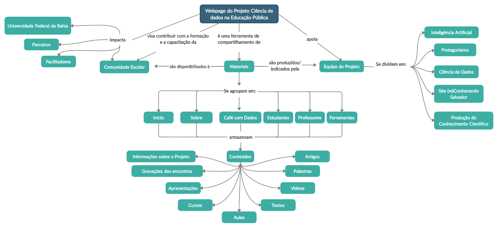

#  Construção do Website do Projeto

O website do Projeto foi construído como ferramenta de compartilhamento de materiais para toda a comunidade escolar, professores, estudantes, coordenadores e gestores (Figura 1). Visando facilitar o acesso ao site (de modo intuitivo) os conteúdos foram organizados e agrupados em: “Início”, “Sobre”, “Café com Dados”, “Professores”, “Estudantes” e “Ferramentas” . Na Figura 2 é apresentado um mapa conceitual da página.
O site “Ciência de Dados na Educação Pública” foi desenvolvido em março, através do Wix, devido a facilidade apresentada pela plataforma na personalização e manipulação de conteúdo. Produzido através de um modelo de template oferecido pelo Wix, o design de interface e estrutura do site precisaram de algumas adaptações para adentrarem na identidade visual do projeto. Ademais estruturalmente, com o objetivo de ampliar a interação com os usuários, todas as páginas do site possuem um espaço para "comentários".
Os materiais presentes no website, foram designados de acordo com as demandas do projeto, dessa forma, a plataforma funcionava como um repositório de informações, sendo possível acessar apresentações, ferramentas, gravações e os mais diversos conteúdos apresentados pela equipe, com o intuito de facilitar as atividades assíncronas e síncronas. 


```{r pagcdnaep, fig.cap='Página inicial do site do projeto Ciência de Dados na Escola Pública', echo=FALSE, message=FALSE, warning=FALSE}
knitr::include_graphics("images/image85.png")
```


```{r diagrpagcdnaep, fig.cap='Página inicial do site do projeto Ciência de Dados na Escola Pública', echo=FALSE, message=FALSE, warning=FALSE}

```