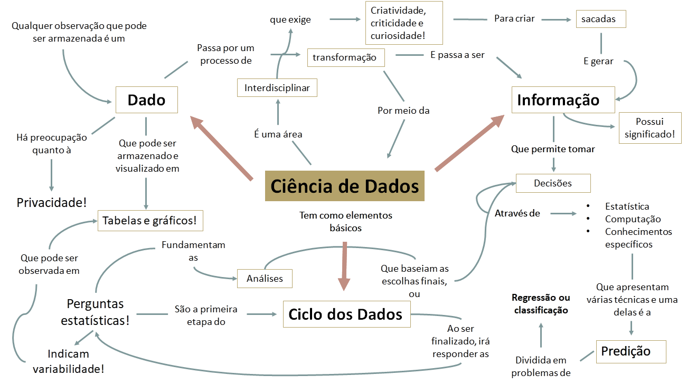

# Elaboração de 4 *e-books*  {#ebooks}
 
O conteúdo dos E-books se subdivide em 4 temas: Ciências de dados, Inteligência artificial, Pensamento científico e Protagonismos. Os três primeiros são destinados aos estudantes e apresentam exemplos pautados na discussão sobre a cidade a partir do site (re)Conhecendo Salvador. As reflexões visam atingi-los, a fim de estimulá-los a se perceberem como protagonistas de mudanças da sociedade, capazes de promover ações nas escolas, em suas comunidades ou em outros contextos da cidade. Os capítulos dos e-books oferecem os objetivos da abordagem de cada assunto, o que se espera dos/as estudantes, sugestões de como abordar o tema em sala de aula, os principais vocábulos, sugestões de leituras, vídeos e páginas em redes sociais (Instagram, Facebook, Pinterest etc.).
O E-book sobre protagonismos social, racial e de gênero é o único volume que se destina especificamente aos professores e visa auxiliá-los na abordagem dos assuntos em sala de aula, dialogando com os conceitos de interseccionalidade (articulação entre raça, classe e gênero), autoconceito, autoestima e empoderamento. A diferenciação entre os protagonismos social, racial e de gênero é didática e visa apenas facilitar a discussão sobre os diferentes temas. Compreendemos que os sujeitos se caracterizam por distintos marcadores sociais e cotidianamente lidam com formas de discriminação sobrepostas. Por isso, necessitam se engajar em estratégias de enfrentamento de modo igualmente articulado.

## *e-book* 1. Ciência de Dados ($80\%$ concluído)

Na Figura \@ref(fig:ebookcd) é apresentado o mapa conceitual do E-book 1 - Ciência de Dados e a Figura \@ref(fig:ebookprotag) exemplifica a apresentação visual do conteúdo do Capítulo 2 deste mesmo e-book.

```{r ebookprotag, fig.cap='Imagem apresentada no Capítulo 2 do E-book de Ciência de Dados.', echo=FALSE, message=FALSE, warning=FALSE}
knitr::include_graphics("images/image116.png")
```

```{r ebookcd, fig.cap='Mapa conceitual do E-book 1 – Ciência de Dados.', echo=FALSE, message=FALSE, warning=FALSE}

```


Cap. 1 - Introduzindo a Ciência de Dados, Cap. 2 - Construindo uma Base de Dados, Cap. 3 - Visualizando Dados, Cap. 4 - Correlação e Causalidade; Cap. 5 - Estatística Inicial; Cap. 6 - Coletando Dados para Pesquisas; Cap. 7 - Distribuições, Probabilidade e Possibilidade; Cap. 8 - Entendendo e Avaliando suas Hipóteses; Cap. 9 - Classificação e Cap. 10 - Regressão.


## *e-book* 2. Inteligência Artificial ($75\%$ concluído)
Cap. 1. - Inteligência Artificial; Cap. 2 - Pensamento Computacional; Cap. 3 - Aprendizado de Máquina; Cap. 4 - Inteligência Artificial e Ciência de Dados; Cap. 5 - Eu como Protagonista de Mudanças na Sociedade; Cap. 5 - Planos de Aula e Materiais; Cap. 6 - Robótica e Programação Desplugada.

## *e-book* 3. Produção do Conhecimento Científico ($50\%$ concluído)
Cap. 1 - Origem da Ciência; Cap. 2 - Investigação Científica; Cap. 3 - Observações e Experimentos Científicos; Cap. 4 - Documento Científico; e a proposta de seis capítulos relacionados à investigação científica na prática (Quanta água tem na minha fruta? O ovo dobrável; Batata com sal, os outros capítulos estão em construção), os experimentos citados se relacionam com conhecimentos das ciências da natureza (química, física e biologia), e tem como objetivo servir de ferramenta para o professor explorar junto com os estudantes o fenômeno da evaporação, conhecimentos sobre a composição química de diferentes frutas, pH, além de possibilitar descobertas relacionadas ao seu cotidiano.

## *e-book* 4. Protagonismo Social, Racial e de Gênero

### Protagonismo Social (proposta em andamento)
Cap. 1 - O Grito dos(as) Excluídos(as); Cap. 2 - Direitos e Deveres da Criança e do Adolescente. O demais capítulos estão em processo de definição.

### Protagonismo Racial ($80\%$ concluído)
Cap. 1 - Blackface, Representatividade negra e Preconceito racial na mídia; Cap. 2 - Colorismo e branquitude; Cap. 3 - Interseccionalidade: raça, gênero e classe; Cap. 4 - Literatura negra; Cap. 5 - Mito da Democracia Racial; Cap. 6 - Necropolítica; Cap. 7 - Racismo no ambiente escolar; Cap. 8 - Racismo e Intolerância Religiosa; Cap. 9 - Políticas de Ações Afirmativas e o Dia Internacional de Luta contra a discriminação racial; Cap. 10 - Tokenismo, segregação e discriminação algorítmica na Inteligência Artificial.

### Protagonismo de Gênero ($0\%$ concluído)
Cap. 1 - A trajetória da construção do conceito (de mulher para gênero); Cap. 2- Sexo e sexualidade; Cap. 3 - Identidade de gênero (homens e mulheres cisgênero e transgênero); Cap. 4 - Orientação sexual (heterossexualidade, homossexualidade e bissexualidade); Cap. 5 - Sexo biológico e expressão de gênero (masculina, feminina e não-binária); Cap. 6- Diversidade sexual e cidadania; Cap. 7 - Movimentos sociais LGBTQI+ e a luta/conquista de direitos; Cap. 8 - Discursos hegemônicos e narrativas sobre homens e mulheres na sociedade brasileira; atribuição de papéis e expectativas sociais; Cap. 9 - Violência de gênero e violência contra a mulher; Cap. 10 - Diversidade sexual na escola e a Atenção à criança e ao adolescente vítima de discriminação por orientação sexual e identidade de gênero; Cap. 11- Representatividade feminina nas ciências; Cap. 12- Protagonismo de gênero e Lei de Diretrizes e Bases (LDB); Cap. 13 - Protagonismo de gênero, Ciência de Dados e Inteligência Artificial (IA).


