# Elaboração de site com estatísticas históricas da cidade de Salvador {#ressa}

A construção do site (re)Conhecendo Salvador requer a realização de cinco etapas: (1) Briefing; (2) Conteúdo; (3) Design; (4) Desenvolvimento e (5) Publicação. A etapa (1) está concluída. Dados e estatísticas de Salvador são explorados individualmente ou conectando os seguintes grandes temas: Educação, Turismo, Segurança, População e Famílias, Ciência e Tecnologia, Lazer e Desporto, Saúde, Transporte, Meio Ambiente e Justiça. Um mapa conceitual deste site é apresentado na Figura \@ref(fig:recossa). A partir das experiências trazidas pelos estudantes são exploradas e sua visão da cidade e sociedade ampliada com a exploração gráfica de dados e estatísticas. Tais habilidades tentam fortalecê-los ao se perceberem como agentes de mudanças da sociedade.

```{r recossa, fig.cap='Desenho esquemático do site (re)Conhecendo Salvador.', echo=FALSE, message=FALSE, warning=FALSE, fig.show='hold',fig.align='center'}
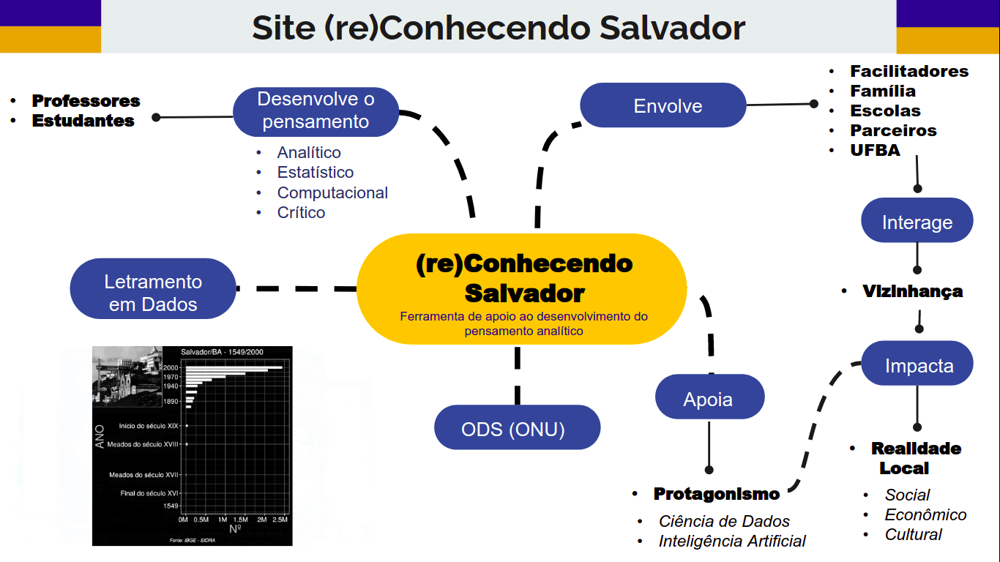
```

Um processo de licitação está em andamento para a contratação de empresa para realizar as etapas (2) e (3). A produção do conteúdo (etapa 5) está em andamento através da definição das perguntas, do levantamento (*webscraping*) dos dados e estatísticas para responder a estas perguntas e da definição de gráficos que sejam visualmente atrativos e que permitam a visualização de tendências e padrões (quando existirem). No Apêndice \@ref(apendperguntas) são listadas perguntas trazidas pelos estudantes e levantadas pela equipe cujos dados e estatísticas já foram inferidos.


## Construção e exploração do site (re)Conhecendo Salvador

### Etapas de desenvolvimento do site (re)Conhecendo Salvador

A ideia do desenvolvimento do site (re)Conhecendo Salvador surgiu ainda no projeto *Meninas na Ciência de Dados*. Ela foi inspirada no projeto [PorData Kids](https://www.pordatakids.pt/Inicio), desenvolvido pela Fundação Francisco Manuel dos Santos, que explora estatísticas de Portugal a partir de questionamentos levantados em diversas áreas como educação, saúde, meio ambiente, transportes entre outros. 
O (re)Conhecendo Salvador servirá como ferramenta de apoio ao desenvolvimento do pensamento analítico a ser utilizado pelos professores e estudantes do projeto, pois irá retratar a realidade da cidade de Salvador através de questionamentos cujas respostas são fundamentadas através de dados. Para isso, algumas perguntas foram levantadas com as estudantes durante ações do próprio projeto, formando um banco de perguntas. 
Para dar início ao desenvolvimento, em abril de 2020, ocorreu a primeira reunião entre as equipes do projeto e da empresa de desenvolvimento InfoJr., para fazer o primeiro briefing com o levantamento de requisitos do site e proposta orçamentária. Posteriormente, já com a equipe do site em ação, novas reuniões foram realizadas para definir o escopo do site. Portanto, as etapas de mapa do site e definição de itens estão concluídas.
O levantamento dos dados para o desenvolvimento do banco de dados responsável por abastecer o site começou em Agosto. Esta etapa ainda está em andamento em decorrência da dificuldade de encontrar dados abertos e que respondam ao nosso banco de perguntas. Para agilizar o desenvolvimento do banco de dados, algumas perguntas estão sendo reformuladas de acordo com os dados já levantados.
A Figura \@ref(fig:steprecossa) apresenta as etapas de desenvolvimento do site. Em relação ao relatório de setembro, tivemos um avanço significativo a partir das entregas da logomarca e identidade visual do (re)Conhecendo Salvador. O design de interface, entretanto, é uma etapa que continua em andamento porque apenas uma tela foi desenvolvida, a tela inicial, porém, a partir dela, e da identidade visual feita pela Alinhavo Jr. será continuado o trabalho de design de interface das páginas seguintes de forma interna. 

```{r steprecossa, fig.cap='Fluxo do processo de desenvolvimento do site (re)Conhecendo Salvador.', echo=FALSE, message=FALSE, warning=FALSE, fig.show='hold',fig.align='center'}
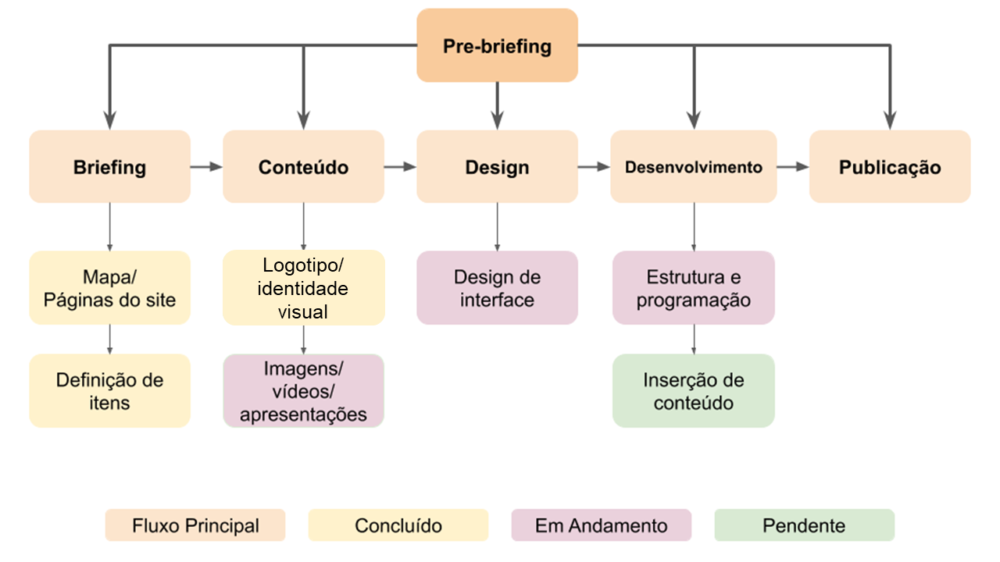
```


### Etapas de desenvolvimento da homepage do site (re)Conhecendo Salvador 
O desenvolvimento da tela inicial do site (re)conhecendo Salvador foi 
realizado de forma incremental entre a equipe idealizadora do projeto e a empresa Alinhavo Jr. Inicialmente, foi realizado uma reunião de 
alinhamento de expectativas e processo de desenvolvimento da 
identidade visual e da interface do site. 
Durante a reunião, novamente, foi apresentada a proposta do projeto, ressaltada a sua relevância e o seu impacto social. O site (re)Conhecendo Salvador, que foi inspirado em um site de Portugal (Pordata Kids), tem como público estudantes de escolas públicas do ensino fundamental 2, e deveria trazer um “mapa” da cidade como ilustração principal, sem perder o aspecto funcional da cidade, retratando suas particularidades, que incluem os contrastes sociais, sua historicidade, porém sem parecer um marketing turístico. A Alinhavo Jr. aproveitou a oportunidade para solicitar que a equipe do site apresentasse referências para que eles pudessem começar o processo de criação dos produtos. Então, foram enviados por e-mail as principais referências de sites para a concepção do (re)Conhecendo Salvador ([Pordatakids](https://www.pordatakids.pt/); [Educa IBGE](https://educa.ibge.gov.br/) e [YouCubed](https://www.youcubed.org/pt-br/)), além de relatórios e apresentações sobre os projetos “Meninas na Ciência de Dados” e “Ciência de Dados na Educação Pública” e suas respectivas logomarcas. 
	

O desenvolvimento da identidade visual e interface contou com a colaboração da equipe do projeto, estudantes e Laboratório de Investigações de Núcleos Habitados (LIN-A), da Universidade Federal de Alagoas (UFAL) e empresa Alinhavo Jr. por meio de encontros virtuais com estes grupo e formulários digitais. Entre as considerações apresentadas neste amplo debate foram destacados os aspectos históricos e urbanísticos da cidade de Salvador, como a percepção dos sentidos como a audição (os sons da cidade de Salvador e a sua musicalidade), o olfato e o paladar (o cheiro característico da cidade proveniente de sua cultura e culinária), além dos aspectos artístico presentes no mais diversos lugares da cidade, remontando, muitas vezes, não apenas suas origens quanto influências sofridas da fundação e desenvolvimento da cidade de Salvador. Adicionalmente, a equipe do site solicitou que a Alinhavo Jr. incluísse no processo de criação a participação dos estudantes por meio do envio de seus desenhos assim como o preenchimento de um questionário específico para os estudantes, para captação de dados. 

A primeira entrega parcial aconteceu no início janeiro de 2021 na presença de toda a equipe desenvolvedora da identidade visual da Alinhavo Jr. e os colaboradores do projeto "Ciência de Dados na Escola Pública". Na entrega parcial foi apresentada a concepção da logomarca do site, a justificativa pela escolha das cores e como a logomarca se relaciona com o projeto. Em seguida, foi apresentada a interface da tela inicial do site, de forma detalhada, desde a apresentação dos menus, da ilustração, das seções de apresentação do site, projeto e grupo de pesquisa, apresentação da equipe, e contatos. Ao final, conclui-se que alguns aspectos precisavam ser ajustados para atingir o objetivo do projeto. A ilustração principal não trazia completamente os aspectos funcionais da cidade e nem respondiam aos temas do menu superior (como educação, saúde, emprego, ciência e tecnologia), estava muito focada nos aspectos históricos e turísticos de Salvador. Também foram solicitadas alterações menores como na cor dos botões, nas cores do logo, para ficarem mais vivas, mudança nos títulos das abas da seção “Sobre o projeto”  de “História” para “Percurso” e “Atividades” para “Dinâmicas”, mudança na seção “nossa equipe” por um único elemento fotográfico, além do desenho de fundo da página, e por fim, uma pequena alteração no rodapé.

A nova versão, havia um esboço da ilustração inicial bastante modificada e mais adequada aos objetivos do site, mas ainda precisava de algum refinamento. Por e-mail foram solicitadas as seguintes alterações:

 **Tela inicial**

 - Substituir a ilustração do prédio da reitoria do IFBA pelo prédio do Barbalho, onde realmente estão concentrados os cursos técnicos e de graduação, pois consideramos ser uma estrutura mais marcante, além de ser a sede (IFBA Barbalho).
 - Colocar as comunidades de Salvador representadas em morros/encostas, uma vez que Salvador é uma cidade de geografia bastante acidentada e marcada pelos seus relevos. Pensar que essa representação poderia ficar ao fundo do hospital e se parecer com a comunidade da Gamboa (Gamboa);
 - Incluir a ilustração de uma baiana junto das pessoas do menu de população, sem grandes destaques, apenas como pessoa que faz parte da população de Salvador;
 - Manter a ilustração do Dique do Tororó com os orixás. Pensamos que, com a modificação das casas das comunidades para atrás do hospital, esse espaço poderia ser ocupado pelo TJ e, assim, o Dique poderia retornar ao espaço onde estava na primeira sugestão de ilustração, embaixo da passarela;
 - Adicionar na ilustração a frase "Andar com fé eu vou que a fé não costuma faiá" de Gilberto Gil como elemento sonoro que representa Salvador;
 - Adicionar na tela inicial o slogan do projeto "Conhecer e experimentar para compreender e transformar.";
 - Alterar o menu superior para um menu horizontal na versão desktop;
 - Aumentar a fonte das informações de contato.

**Sobre o projeto**

 - Trocar a ilustração ao lado direito do canto superior pelo Pelourinho com a igreja azul, Nossa Senhora do Rosário dos Pretos (pode ser a ilustração da tela inicial da primeira proposta);
 - Substituir o rapaz negro no canto inferior esquerdo por uma mulher acompanhada de uma criança (mãe e filha); 
 - Aumentar a fonte do texto dentro dos boxes de percurso, dinâmica e Gamma.

 **Equipe** 

 - Substituir gráficos de fundo por uma ilustração da entrada da politécnica, pois representa o lugar onde a equipe está localizada (Politécnica) e a própria UFBA, que não apareceu em outros lugares do site.

A entrega dos produtos foi realizada ao final de Janeiro de 2021 através do compartilhamento dos arquivos em nuvem.  Abaixo, serão apresentadas a logomarca e a tela inicial do site.
A logomarca é o elemento de identidade visual mais representativo.  Assim, a logomarca do projeto foi desenvolvida para conversar entre a proposta do projeto Ciência de Dados na Educação Pública e do grupo de pesquisa GAMMA. A proposta que foi apresentada pela Alinhavo Jr. e aceita pela equipe está apresentada na Figura \@ref(fig:logorecossa).

```{r logorecossa, fig.cap=' Logomarca oficial do site (re)Conhecendo Salvador.', echo=FALSE, message=FALSE, warning=FALSE, fig.show='hold',fig.align='center'}

```

A logomarca traz elementos que representam o sol e as pessoas, assim como o céu de Salvador. O movimento das ondas do mar está representado através de parábolas, que se abraçam, trazendo a sensação do afeto que é tão importante para o projeto. Os “dedos” também fazem alusão à representação do gráfico de barras, representando a ciência de dados e a estatística. 
A interface da página inicial do site (re)Conhecendo Salvador aprovada pela equipe está apresentada nas figuras \@ref(fig:ilustrecossa), \@ref(fig:sobrerecossa), \@ref(fig:equiperecossa) e \@ref(fig:contatorecossa) (ilustração, sobre o projeto, equipe e contato respectivamente).

```{r ilustrecossa, fig.cap='Apresentação e ilustração/menu do site (re)Conhecendo Salvador', echo=FALSE, message=FALSE, warning=FALSE, fig.show='hold',fig.align='center'}
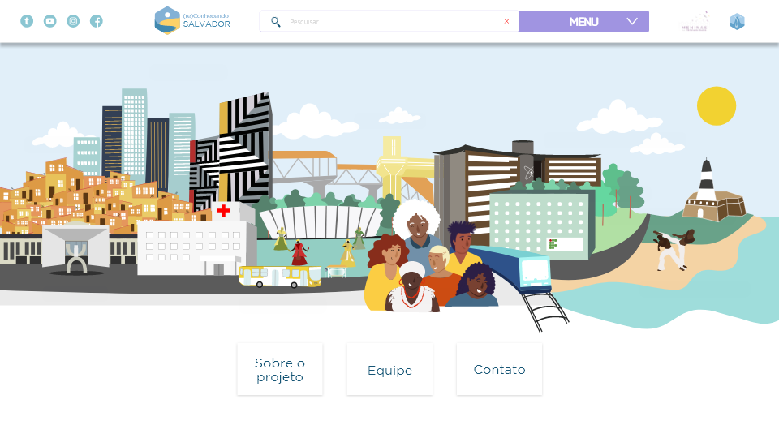
```

```{r sobrerecossa, fig.cap='Seção “Sobre o Projeto”.', echo=FALSE, message=FALSE, warning=FALSE, fig.show='hold',fig.align='center'}
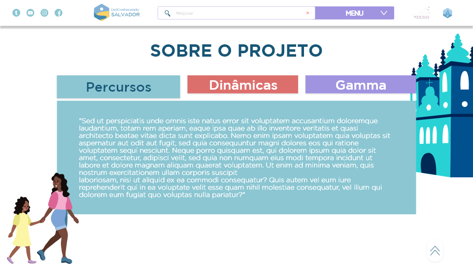
```

```{r equiperecossa, fig.cap='Seção “Equipe”.', echo=FALSE, message=FALSE, warning=FALSE, fig.show='hold',fig.align='center'}
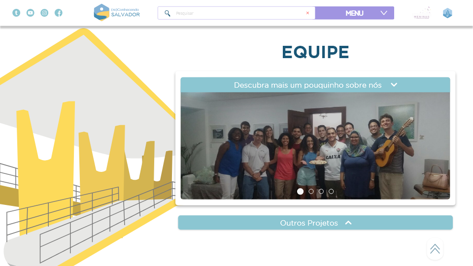
```

```{r contatorecossa, fig.cap='Seção “Contato”.', echo=FALSE, message=FALSE, warning=FALSE, fig.show='hold',fig.align='center'}
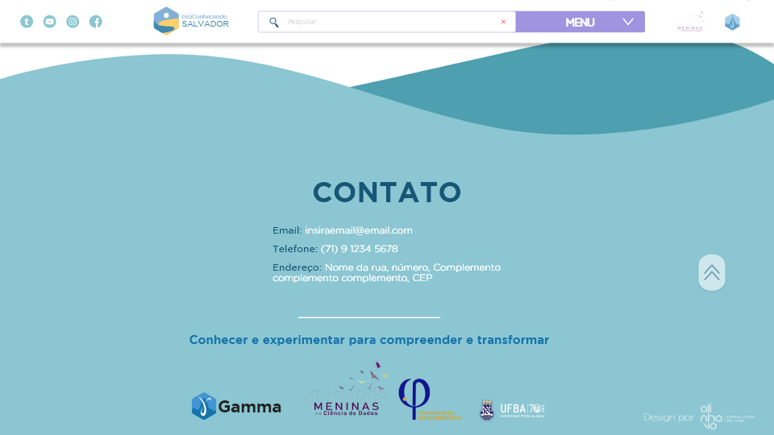
```

Durante o período de licitação da empresa de desenvolvimento da *homepage*, a equipe dedicou-se ao desenvolvimento de uma versão beta do site que é detalhado nas seções a seguir.
	
Durante o período de licitação da empresa de desenvolvimento da *homepage*, a equipe dedicou-se ao desenvolvimento de uma versão beta do site que é detalhado nas seções a seguir.

## Desenvolvimento do site na versão beta (teste) com módulos gráficos

Em função das dificuldades para a contratação de empresas para o 
desenvolvimento do site (re)Conhecendo Salvador, a equipe resolveu 
desenvolver uma versão beta (de teste) internamente utilizando o 
gerenciador de conteúdo (CMS) Wordpress,  que é uma plataforma 
gratuita, open source bastante robusta e confiável, utilizada em sites de grandes empresas como a Walt Disney, Globo (G1), Sony Music e Toyota. Para isso, inicialmente foi feita uma capacitação online e gratuita através da plataforma Mirago. 
A capacitação em Wordpress durou, aproximadamente, duas semanas, e ocorreu em paralelo às demais atividades do projeto. Para desenvolver o site (re)Conhecendo Salvador utilizando o Wordpress foi necessário instalar no computador servidores web e de banco de dados (Apache e MySQL), através do MAMP 4.2.0, que é um pacote de servidores que prepara  o ambiente localhost para receber o gerenciador de conteúdos. Somente após a instalação dessa infraestrutura é possível instalar o Wordpress na máquina. Vale salientar que a versão utilizada no desenvolvimento deste site foi o Wordpress.org, e por isso foi necessário preparar o ambiente da máquina para recebê-lo. Ele foi escolhido em detrimento da versão Wordpress.com por ser mais customizável e atender melhor aos requisitos do site.
A próxima etapa de desenvolvimento do (re)Conhecendo Salvador versão beta foi a pesquisa e escolha do tema a ser utilizado no wordpress. O tema corresponde à uma estrutura básica de telas que pode ser instalada no wordpress.org e customizada de acordo com as necessidades da proposta do site. Foi feita uma pesquisa de temas para descobrir o melhor custo benefício para desempenho e funcionalidades do site. Dentro das opções gratuitas, foi escolhido o tema Neve pois apresenta uma estrutura mais robusta e flexível, permitindo  customizações das telas nos mais diversos aspectos. Após a instalação do CMS e da escolha do tema, ainda foi necessário fazer a instalação do plugin Elementor, dentro do Wordpress, na versão gratuita, para aprimorar as possibilidades de construção de layouts das telas.
A diagramação das telas seguiu o fluxo de telas do site Pordata Kids: tela inicial > tela de submenus dos temas > painel de perguntas > dashboards com gráficos. A logomarca, os elementos do menu principal e os botões foram todos criados utilizando dos recursos gratuitos oferecidos na plataforma de design online Canva (Figura \@ref(fig:logotrecossa), \@ref(fig:botaotrecossa), \@ref(fig:voltartrecossa) e \@ref(fig:botaointtrecossa))


```{r logotrecossa, out.width = "50%",fig.cap='Logomarca da versão teste.', echo=FALSE, message=FALSE, warning=FALSE, fig.show='hold',fig.align='center'}
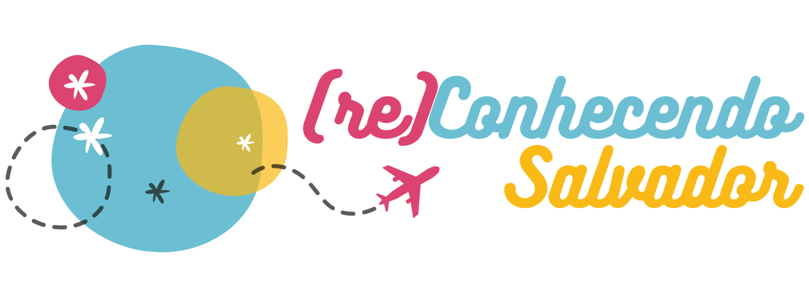
```

```{r botaotrecossa,out.width = "150%", fig.cap='Botões do menu principal', echo=FALSE, message=FALSE, warning=FALSE, fig.show='hold',fig.align='center'}
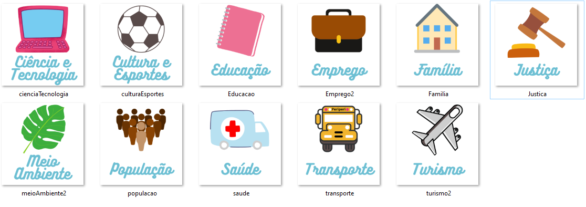
```

```{r voltartrecossa, out.width = "50%",fig.cap='Botão de rodapé.', echo=FALSE, message=FALSE, warning=FALSE, fig.show='hold',fig.align='center'}

```


```{r botaointtrecossa, out.width = "50%",fig.cap='Botões dos painéis dos subtemas educação, população e segurança, de cima para baixo, respectivamente.', echo=FALSE, message=FALSE, warning=FALSE, fig.show='hold',fig.align='center'}
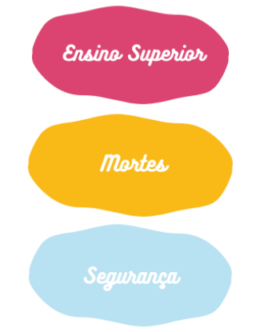
```

Depois de iniciar o desenvolvimento na máquina local, optamos por transferir a versão a um servidor online e gratuito para que outros membros da equipe pudessem visualizar e até mesmo modificar a estrutura do que estava proposto. Após algumas pesquisas, o servidor escolhido foi o [Awardspace](https://www.awardspace.com/). Esse servidor oferece instalador automático do WordPress, o que facilitou bastante a migração da versão desenvolvida no computador local para o servidor online, hospedagem sem anúncios, além de ter espaço em disco igual a 1GB, largura de banda de 5GB, e banco de dados MySQL. Para fazer a migração, foi necessário instalar no wordpress da máquina o plugin All-in-One, nativo no Wordpress do Awardspace. Entretanto, após fazer a migração para o servidor online, a equipe achou melhor continuar o desenvolvimento em localhost e utilizar o servidor online apenas para apresentar e compartilhar as mudanças e evoluções nas versões.

Os dados relacionados aos temas são apresentados em dashboars, embutidos nas páginas de respostas das perguntas, desenvolvidos em R, conforme descrito na seção “Descrição do layout dos dashboards”.

A seguir, serão apresentadas as telas da versão teste do (re)Conhecendo Salvador de acordo com o fluxo de navegação:

 - Tela inicial (Figura \@ref(fig:teleinicialtrecossa))
 - Painel do submenu dos Temas (Figura \@ref(fig:painelsubtrecossa))
 - Painel de Perguntas (Figura \@ref(fig:paineldisptrecossa) )
 - Dashboard com a apresentação dos dados em gráficos (Figura \@ref(fig:dashtrecossa))


```{r teleinicialtrecossa, out.width = "100%",fig.cap='Tela inicial/ Página Principal.', echo=FALSE, message=FALSE, warning=FALSE, fig.show='hold',fig.align='center'}
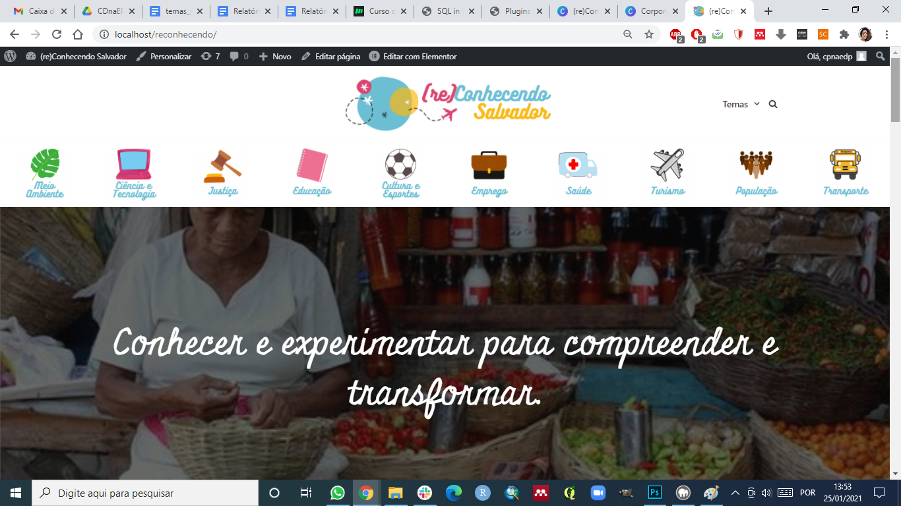
```


```{r painelsubtrecossa, out.width = "100%",fig.cap='Painel do submenu do tema.', echo=FALSE, message=FALSE, warning=FALSE, fig.show='hold',fig.align='center'}
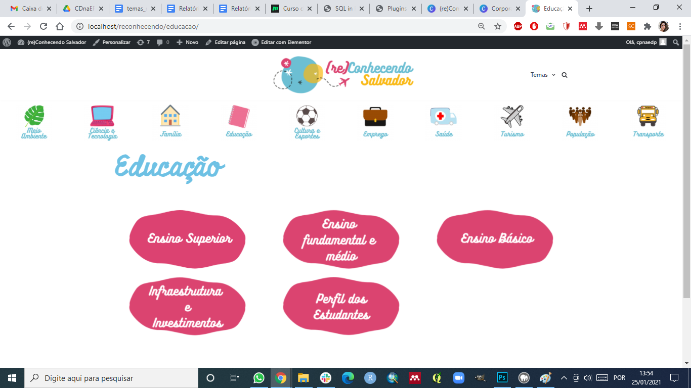
```


```{r paineldisptrecossa, out.width = "100%",fig.cap='Painel de perguntas disparadoras.', echo=FALSE, message=FALSE, warning=FALSE, fig.show='hold',fig.align='center'}
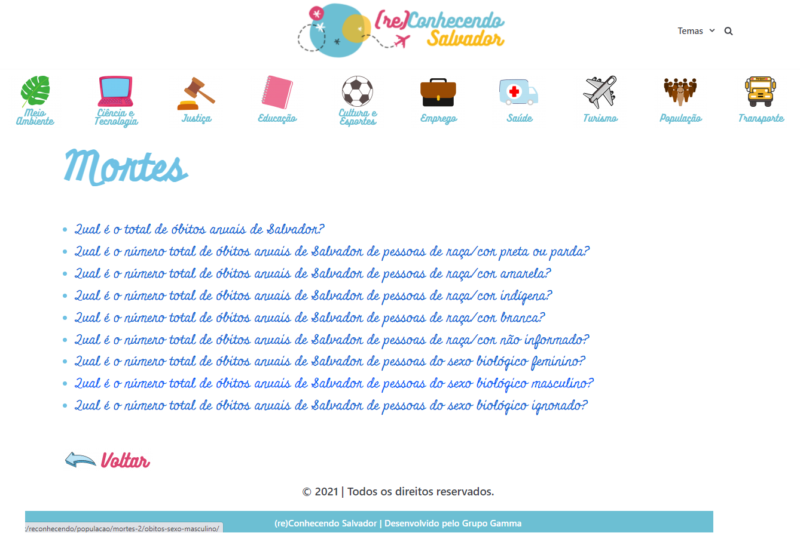
```


```{r dashtrecossa, out.width = "100%",fig.cap='Painel de perguntas disparadoras.', echo=FALSE, message=FALSE, warning=FALSE, fig.show='hold',fig.align='center'}
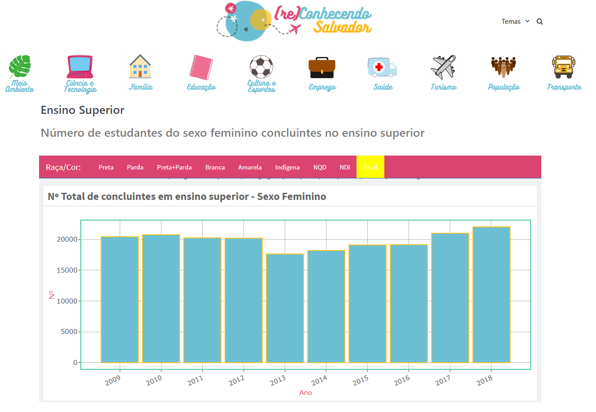
```

## Levantamento dos Dados e Informações 

A representação gráfica de dados públicos é uma prática muito comum na área de Data Science. Entretanto, o processo de representação de informações está sujeito inicialmente à qualidade da pesquisa, ou seja, ele é tão mais relevante para sua interpretação quanto mais precisa é a informação. Mas não apenas estes elementos são importantes, a seleção adequada das formas gráficas, cores e aspectos dinâmicos podem interferir nesse desempenho do uso da informação. A ciência de dados formalmente tem as seguintes etapas: coleta, limpeza, análise exploratória, desenvolvimento e implementação do modelo. Em quase todas as etapas, a visualização de dados tem um papel fundamental como ferramenta na construção da informação. Assim, o elemento da visualização de dados pode ser utilizado como forma de introdução do estudante de escola pública na área de dados da sua cidade e em paralelo como mecanismo de familiarização com ciência de dados. 
O processo de construção de informações é razoavelmente longo e pode surgir de diferentes objetivos e enfrenta limitações para realização das pesquisas de campo, bem como o registro e gestão desta informação. Estes aspectos são a priori essenciais para determinar a qualidade da informação obtida, bem como a capacidade de ajudar em análises estatísticas.  O acesso aos diferentes níveis de informação, a forma como é disponibilizada também limita a capacidade de análise. O IBGE por exemplo possibilita por meio de um cadastro e treinamento para grupos pré-avaliados, a forma mais elementar da suas pesquisas num sistema chamado Banco Multidimensional de Estatísticas (BME)  que contém os microdados das pesquisas e os respectivos metadados. Recentemente, a Escola Nacional de Administração Pública (Enap) vinculada ao Ministério da Economia (ME), produziu o livro Guia brasileiro de análise de dados: armadilhas & soluções, neste documento são demonstrados de forma não tão introdutória os principais desafios em diferentes bancos de dados públicos. Ainda na apresentação do livro os autores são bem enfáticos em apontar que mesmo pesquisadores experientes, frente a um banco de dados novos, podem cometer equívocos na interpretação das informações. Alcançar o público dos estudantes não é uma tentativa isolada, é muito comum no mundo científico, especialmente em instituições de pesquisa e museus a prática de desenvolvimento de materiais didáticos, paradidáticos, jogos e ações para difusão do conhecimento científico para estudantes. Instituições como a Fiocruz, CEMADEN, Butantan,  INPE e etc, promovem estes tipos de ações com recortes específicos das respectivas áreas. Quando tratamos de uma cidade, do meio urbano, da geografia temos IBGE que dispõem de ações como Educa IBGE dedicado a crianças e adolescentes. A maioria desses materiais e sistemas em certa medida estão distantes da realidade estudantil e fica necessário o papel da escola realizar esta aproximação de vivência do estudante e as informações e materiais disponíveis por essas instituições. O desenvolvimento do site por meio da visualização de dados da cidade de Salvador cumpre de forma mais adequada este papel.     
Nas escolas públicas há uma grande variedade de experiências dos estudantes e por outro lado há uma mudança da forma de apresentação das informações que cada vez mais ampliam em qualidade e quantidade devido aos avanços tecnológicos. Devido às pressões geradas para a tomada de decisões baseada em informações de instituições ligadas ao governo federal, estadual e prefeituras municipais há uma necessidade clara da preparação do estudante para este mundo da informação e tecnologia. Letrar-se neste universo complexo e de disputas de narrativas exige o conhecimento empírico do mundo da informação como posta e a sua plena mudança. O caminho estabelecido pelo mundo das ferramentas livres, bem como a legislação de dados abertos abre possibilidades sem precedentes. A inclusão dos estudantes neste universo é uma ação de acesso a linguagem com que o mundo realiza  as suas disputas, exclusões e recorte de oportunidades.  
Desde o procedimento de pesquisa para coleta de dados de interesse públicos, o objetivo que definiu a necessidade dessa informação e a política de  disponibilização de informações configuram um cenário bastante sensível às interpretações. Dado o contexto de letramento em dados deve-se considerar que devemos potencializar  a aproximação dos estudantes aos dados por meio das suas próprias experiências. Neste sítio em desenvolvimento desejamos a priori  que o estudante tenha uma imersão em séries históricas de dados sobre a evolução da população, crimes, eventos esportivos, educação etc. Todos esses temas relacionados à cidade de Salvador. Naturalmente, em alguma medida o estudante é capaz de interpretar informações de outras cidades e quiçá outros países, mas a hipótese essencial do projeto é que mergulhado na sua realidade o estudante vai além da interpretação ingênua. Ele torna-se capaz de argumentar sobre sua realidade. Passa dessa maneira a ser agente de proposição confrontado com pares com conhecimento e vivências similares. Essa dinâmica foi experimentada em certa medida em encontros realizados com 30 estudantes de 5 escolas públicas de Salvador. 
O levantamento das informações que auxiliam nas respostas às perguntas disparadoras dos estudantes são realizadas com os seguintes pilares:

 - Os dados tem que ser abertos;
 - Disponibilizados em sites de governos e organizações não governamentais, preferencialmente que sejam tabulados e rastreáveis;  
 - Aqueles que promovam debates interessantes aos estudantes e professores. 

Respeitado tais critérios, também é necessário algum desenvolvimento para a qualificação do dado ou informação. Dada a complexidade dos bancos de dados disponibilizados ao nível de microdados (desagregados de forma individualizada) é preciso um processo de compatibilização entre os diferentes anos e ao final é preciso uma etapa de verificação da informação. Após esta etapa, é da natureza deste trabalho a verificação visual da informação como forma de avaliação da riqueza da informação como meio de um processo educativo. Assim, essas etapas metodológicas são cumpridas por meio de recursos de programação como linguagens python, R, Bash  e recursos de captura de informações de pdf.   
Na lista abaixo descrevemos alguns avanços dos bancos de dados ligados aos temas e questões apresentados pelos estudantes e professores participantes de atividades do projeto Meninas nas Ciências de Dados - 2019:

### Dados de População
  Informações sobre a população brasileira em geral são disponibilizadas de forma desagregada ao nível dos municípios pelos produtos gerados pelo Instituto Brasileiro de Geografia e Estatística (IBGE), de forma organizada tais informações são encontradas no site  (https://cidades.ibge.gov.br/).  Particularmente no livro Geografia de Salvador de Andrade, Adriano Bittencourt (2009) é apresentado levantamento de informações sobre a dimensão da população de Salvador em épocas que precedem a existência do IBGE, partindo de meados do século XVI até o ano 2000 (Censo demográfico de 2000). O interesse dos estudantes  em dados não é limitado à evolução do tamanho absoluto da população, mas suas divisões etárias, de gênero e raça que foram exploradas para composição do banco de dados do projeto. O subtema da população é muito central no debate sobre Salvador e o coloca num dos maiores desafios de desigualdade social encontrado nas metrópoles brasileiras. Portanto, o uso dos dados do Censo Demográfico são fundamentais na composição dos bancos de dados. Mas a imersão do estudante na sua localidade pode ser melhor explorada quando a informação é desagregada ao nível do seu bairro, como disponibilizado pela Casa Civil da prefeitura de Salvador (http://casacivil.salvador.ba.gov.br).  O Programa das Nações Unidas para o Desenvolvimento (PNUD)  construiu um resumo de informações sobre Salvador que está digitalmente apresentado  na página (http://www.atlasbrasil.org.br/perfil/municipio/292740#sec-demografia), na qual os dados estão desagregados por sexo biológico e  raça. Embora sejam dados simples, eles remetem aos eixos transversais de temas críticos nas dimensões de desigualdade social. 


### Dados de Educação   

Os dados de educação do ensino básico, fundamental e superior estão disponíveis como dados abertos no site do Instituto Nacional de Estudos e Pesquisas Anísio Teixeira - INEP.  Os dados de educação utilizados são oriundos do Censo Escolar dos anos de 2009-2019, Censo do Ensino Superior de 2009-2019, dados georreferenciados das escolas públicas de Salvador (site: http://educacao.salvador.ba.gov.br/educacao-em-numeros/), arquivos vetoriais georreferenciados dos bairros e das prefeituras bairro de Salvador foram obtidos a partir de cooperação da Secretaria da Fazenda. Algumas informações foram obtidas do Atlas Brasil - PNUD Programa das Nações Unidas para o Desenvolvimento. Parte das informações construídas de tais bancos foram verificadas por meio do site: https://www.qedu.org.br/. Informações ligadas ao Ensino Superior são verificadas pela comparação entre relatórios institucionais de universidades como os gerados pela Pró-Reitoria de Planejamento e Orçamento da Universidade Federal da Bahia (Proplan/UFBA) e a agregação de microdados disponibilizados pelo Instituto Nacional de Educação Anísio Teixeira. Informações sobre a estrutura das escolas,   no formato de dashboard, foram disponibilizadas pelo pesquisador em Dados Abertos Fernando Barbalho.  

### Dados de Turismo
Dados de Turismo foram coletados a partir de informações disponibilizadas a partir de relatórios das Secretaria de Turismo do Estado da Bahia – SETUR, Superintendência de Investimentos em Zonas Turísticas – SUINVEST, Diretoria de Planejamento Turístico – DPT. Detalhamento sobre ocupação de hotéis, número de voos diários nacionais e internacionais foram organizados como banco de dados utilizando informações do Observatório do Turismo da Bahia (http://www.observatorio.turismo.ba.gov.br/). A natureza da sensação de segurança do turista em Salvador foi avaliado no Relatório do Perfil do Turista que visita o Carnaval de Salvador (2019). Informações disponíveis neste relatório podem auxiliar professores e estudantes a refletir sobre a interseção dos temas.

### Dados de segurança pública

A  Secretaria de Segurança Pública do Estado da Bahia  SSP-BA (http://www.ssp.ba.gov.br/) disponibiliza seus boletins mensais de crimes violentos contra vida e crimes contra patrimônio, estas informações estão desagregadas pelas Áreas Integradas de Segurança Pública (AISP), a cidade de Salvador  contém 16 AISPs. A partir de tais dados foi organizado o primeiro banco de dados de segurança com 9 crimes, entretanto tais informações não atingem o detalhamento dos temas transversais de gênero e raça. Recentemente, uma publicação realizada pela Rede de Observatórios da Segurança traz um caminho para obtenção de informações desagregadas por gênero e raça por meio dos relatórios A cor da violência na Bahia - Uma análise dos homicídios e violência sexual na última década (2017) e Racismo Motor da Violência (2020). As informações apresentadas em tais relatórios são obtidas do SINAN/DATASUS e IBGE. Entretanto, diferente do site da SSP-BA, as informações disponibilizadas de mortes por agressão do sistema CID10 - TabNet - DataSUS não são desagregadas por AISP. Algumas informações a respeito das corporações foram obtidos por meio do Painel do Perfil Nacional das Instituições de Segurança Pública (2019) que inclui informações da Polícia Militar, Polícia Civil e Corpo de Bombeiros  produzido pelo Ministério da Justiça e Segurança Pública. Estes dados são desagregados por unidades da federação com os recortes dedicados às capitais. 

### Dados da área de transporte 

Quanto aos dados da infraestrutura do sistema de transporte de Salvador foram obtidos pelo Anuário de Transportes Urbanos de 2018, produzido pela Secretaria de Mobilidade de Salvador (Semob) no qual é levantado um histórico da evolução das frotas de veículos de Salvador, informações sobre tarifas, veículos com elevadores. Os dados disponibilizados não incluem o recorte sócio-econômico do sistema de transporte urbano ou o debate do sistema cicloviário da cidade. As informações identificadas estão disponibilizadas apenas no formato pdf. Portanto, foi criado um banco de dados com tais informações bem como dados disponibilizados pela prefeitura a respeito das notificações de infrações de trânsito que são desagregadas de forma individualizada, identificando apenas o veículo pelo número da placa e o tipo de infração. Um recorte especial foi realizado para as operações da Lei Seca, que incluem dados mensais das infrações desagregadas por recusa administrativa, crimes e outras.  As informações sobre o trânsito de Salvador também são acompanhadas em tempo real por meio de um painel dinâmico que apresenta as principais vias e suas velocidades e a classifica a qualidade do trânsito de Salvador. Outra forma de acompanhamento é realizada pela disponibilização de boletins diários de trânsito  do Núcleo de Operação Assistida (NOA) que informam os acidentes diários ocorridos em Salvador, porém, não há disponibilização de todos os documentos, apenas do dia anterior. 

### Dados de Saúde 

Os dados da área de saúde foram coletados a partir do sistema DATASUS, por meio do Tabnet atualizado pela Secretaria Municipal de Saúde de Salvador. As consultas ao sistema são realizadas via esta interface web que divide a informação em três áreas principais, Assistência a Saúde, Estatísticas Vitais e Notificações de Agravos.  As informações coletadas  neste banco de dados são pertinentes não só para a área de saúde mas também para a composição das classes do site como população e meio ambiente. 

### Dados de Meio Ambiente

Os dados de meio ambiente estão disponíveis no site Painel do Saneamento Brasil, desenvolvido pelo Instituto Trata Brasil.  O Sistema Nacional de Informações sobre Saneamento (SNIS),  disponibiliza séries históricas de  dados de água, esgoto, resíduos sólidos e outras informações desagregadas por municípios. É necessário, contudo, reforçar na produção de materiais didáticos a qualidade das informações apresentadas. Frequentemente, especialistas criticam o nível de incerteza das informações disponibilizadas em nossos sistemas. Além disso, o Brasil sofre adicionalmente com a condição precária da baixa cobertura  do saneamento básico. 

### Dados de Emprego e Trabalho

Os dados da área de  Emprego e Trabalho estão disponíveis no Sistema IBGE de Recuperação Automática (SIDRA). Este sistema possui uma interface interessante para poucas coletas de dados, ou tabelas específicas. Iniciativas para facilitar a coleta de dados do sistema de forma mais ampla foi criada para a linguagem R, o pacote em questão é o sidraR. Utilizando esta biblioteca sidraR  foi possível coletar dados da Pesquisa Nacional de Amostra a Domicílio (PNAD) que contém informações sobre população ocupada, população em idade de trabalhar, rendimento médio da população etc. O pacote permite que você defina tanto a abrangência   temporal quanto geográfica. A frequência disponível dessas informações varia desde anual até mensal. E quanto a abrangência geográfica pode variar desde nacional até municipal. Essa integração facilita a automatização de materiais didáticos pois dispensa a necessidade de atualização do banco de dados uma vez que essa recuperação pode ser feita por meio do pacote utilizando apenas a informação do número da tabela.

Nem todas as informações coletadas durante o processo de atendimento das perguntas dos estudantes são utilizadas para este fim específico. Algumas informações são necessárias para a construção de contexto para amplo debate com o estudante. A ponte entre os materiais desenvolvidos nos ebooks e a transversalidade no contexto geral de gênero e raça são  pontos focais das questões originais e no levantamento dos dados. É necessário que os professores e  os estudantes debatam a origem das fontes dos dados e compreendam quais instituições têm promovido  a democratização da informação para a transformação dos indivíduos.

A exploração destes dados, frente ao escopo de perguntas elaborado no projeto Meninas na Ciência de Dados, norteou a construção de visualizações gráficas, incluídas como estratégia de desenvolvimento de letramento em dados e estatística nos encontros semanais (Ver Figura \@ref(fig:reunicossa)).  

```{r reunicossa, fig.cap='Exploração dos temas de Segurança Pública e de Mobilidade Urbana.', echo=FALSE, message=FALSE, warning=FALSE, fig.show='hold',fig.align='center'}
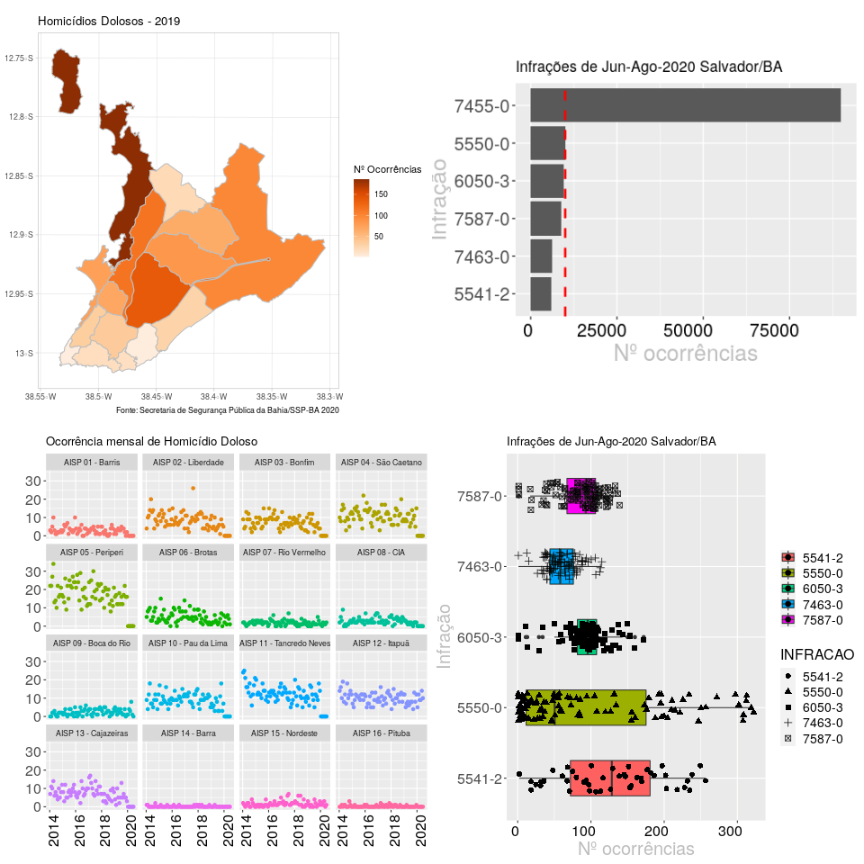
```

## Representação gráfica dos dados e desenvolvimento dos Dashboards

Para alcançar o desenvolvimento do ambiente de dados na forma gráfica mais apropriada para este estímulo ao conhecimento, exploramos a linguagem mais popular e de fácil implementação. Utilizamos os recursos da linguagem R, com dados na sua maioria disponibilizados no formato de csv. A linguagem R é capaz de trabalhar com um recurso amplo de ferramentas, entre suas principais qualidades está a programação com markdown. Entre as vantagens de se trabalhar com markdown no R está a produção de textos, documentos, livros e websites com estruturas muito simples de programação e a possibilidade de produção de saídas em html. Essas saídas podem ser configuradas com programação via linguagem css. Outras importante característica está na forte integração com outras linguagens amplamente utilizadas na área de ciência de dados como Python, Julia, C++ e SQL. Quando se trabalha com estas fontes de programação atuamos para o benefício de um fim público com custo muito baixo, prática muito comum da área de software livre. A linguagem R tem a seu dispor uma importante ferramenta para a produção de APIs, Shiny. Especialmente nesta estrutura é possível produzir interfaces para que o usuários seja capaz de fazer filtros, definir faixas de apresentação de informações, usufruir dos códigos de inferência do R com a flexibilidade de funcionamento em versão Desktop ou Mobile. Esta importante estrutura do R tem os elementos pré programados que aceleram a produção dessas interfaces de apresentação gráfica e interação com o usuário. Há ainda no R uma estrutura de código para produção de interfaces mais simples chamada de Flexdashboard  com a vantagem de ser facilmente integrável a estruturas de sites produzidos em Wordpress. 
Para o desenvolvimento dos dashboards foi optado pelo controle de versões realizado via Github na conta do projeto [Ciência de Dados na Escola Pública](https://github.com/orgs/cienciadedadosnaep/). O ambiente do github permite a publicação do do dashboard na forma de website desde que o repositório desenvolvido esteja no modo público. Assim é possível ao mesmo tempo, produzir o dashboard,  realizar controle de versões, permite a integração com o desenvolvimento da Website e mantém  o padrão da política de dados abertos.  A disponibilidade do código dos dashboards em formato aberto tem entre outras vantagens a fácil difusão do conhecimento para que outras cidades que desejem aderir à proposta de reconhecimento das suas cidades por meio de dados. Para alguns tipos de dados como pirâmide etárias ou dados desagregados por faixa etárias foi utilizado um formato no qual o controle de versões é realizado por meio do Github porém a publicização do dashboard foi realizado no repositório Appshiny. As Figuras \@ref(fig:dashm1cossa) a \@ref(fig:dashm3cossa) são a representação de um dos [dashboards](https://robsonpessoa.shinyapps.io/piramide_etaria/) desenvolvidos para uso do website. A Figura \@ref(fig:dashm1cossa) demonstra a estrutura geral do dashboard que inclui uma estrutura de seleção da classe, que funciona como filtro para o banco de dados que são utilizados na renderização do gráfico. Esta estrutura foi desenvolvida utilizando o Flexdashboard com elemento de entrada sendo incluindo como uma funcionalidade do pacote Shiny, no preâmbulo do Flexdashboard  é utilizada a linguagem yaml e assim é possível integrar estes pacotes (runtime: shiny). A Figura \@ref(fig:dashm2cossa) dá destaque ao sistema de seleção com barra de rolagem. No corpo principal foi utilizado o pacote dplyr do R para gestão dos dados enquanto as figuras foram produzidas por meio do ggplot2. Algumas funcionalidades como zoom, destaque de áreas, impressão da visualização atual do gráfico e o recurso mouseover obtido pela aplicação do pacote ggplotly, na figura \@ref(fig:dashm3cossa), no canto superior direito é possível ver os botões destes recursos. Também foi testado o pacote echarts4r, com sua base em Java Script, tem forte integração com o pacote dplyr. Embora tenha uma estética simples e agradável e bom comportamento, não tem a mesma variedade de opções gráficas que ainda será necessária em futuras modificações do website.


```{r dashm1cossa, fig.cap=' Dashboards  com dados de número de óbitos anuais de Salvador apresentados em gráficos de linha e caixa de seleção de classe.', echo=FALSE, message=FALSE, warning=FALSE, fig.show='hold',fig.align='center'}
knitr::include_graphics("images/image65.png")
```

```{r dashm2cossa, fig.cap='Destaque da caixa de seleção de faixas etárias.', echo=FALSE, message=FALSE, warning=FALSE, fig.show='hold',fig.align='center'}
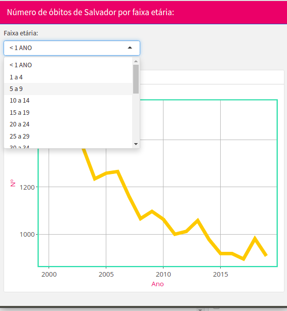
```

```{r dashm3cossa, fig.cap='Destaque para o comportamento de resposta do gráfico ao movimento do ponteiro do mouse.', echo=FALSE, message=FALSE, warning=FALSE, fig.show='hold',fig.align='center'}
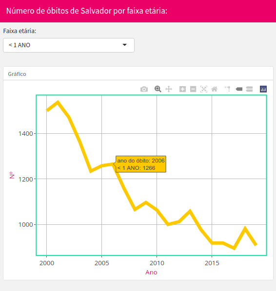
```


Também com intuito de exemplificar os dashboards desenvolvidos, demonstramos na Figura \@ref(fig:dashm4cossa) construída de forma estática, ou seja, sem recursos Shiny,  a possibilidade de criar uma estrutura que ao invés de filtrar dados temos as diferentes variáveis dispostas num sistema de abas com destaque em amarelo para aquela que está em uso. 

```{r dashm4cossa, fig.cap='Dashboard de Crimes Violentos contra o Patrimônio, é formado por 3 abas com séries temporais dos crimes Roubo à ônibus (destacada em amarelo), Roubo de Veículo e Furto de Veículo.', echo=FALSE, message=FALSE, warning=FALSE, fig.show='hold',fig.align='center'}
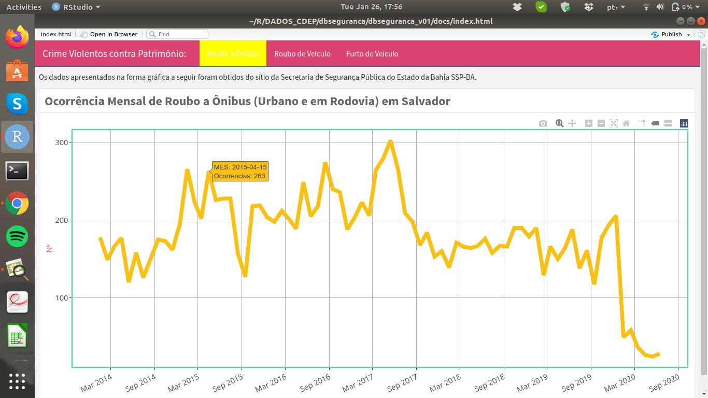
```


A opção de diferentes formas gráficas e diferentes disposições do dashboard ocorre de acordo com o tipo de variável e nível de dificuldade apropriado ao estudante, vejamos os dados de população apresentada na Figura \@ref(fig:dashm5cossa). Neste dashboard foi optado pela forma gráfica recorrente no ensino fundamental para apresentação de informações por faixa etária e pirâmide etária. Ao lado da pirâmide etária é apresentado o levantamento histórico do número de pessoas residentes em Salvador desde o  século XVI.


```{r dashm5cossa, fig.cap='Dashboard de população com dados do Censo de 1991, 2000 e 2010 disponíveis como pirâmide etário e do lado direito a evolução da população de Salvador a partir do século XVI.', echo=FALSE, message=FALSE, warning=FALSE, fig.show='hold',fig.align='center'}
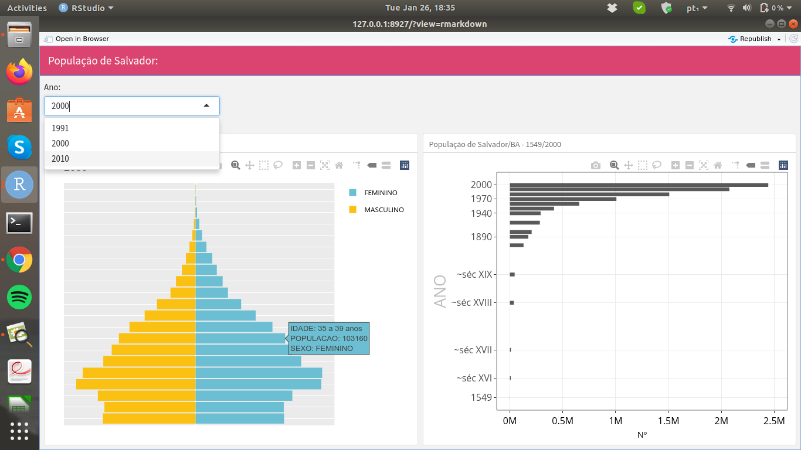
```


