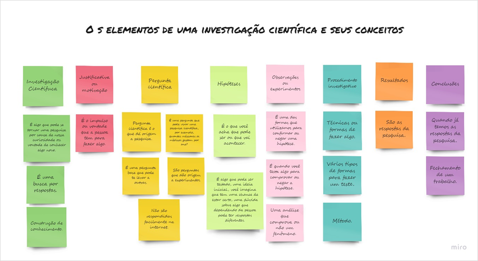

#  Desenvolvimento do pensamento científico {#prodconh}

As atividades relacionadas ao desenvolvimento do pensamento científico envolvem a construção do E-book (relatado na seção \@ref(ebookpcc)), o fortalecimento do pensamento científico das/os estudantes nos encontros virtuais e a sua mobilização para que participem de eventos científicos. 
Tais atividades se baseiam em três eixos estruturantes da alfabetização científica: (a) Compreensão básica de termos e conceitos científicos, em que são trazidos aos estudantes elementos que compõem uma investigação científica (conhecimento); (b) Compreensão da natureza da ciência e os fatores que circundam sua prática, demonstrando a importância da investigação científica e sua diversidade (reconhecimento); (c) Compreensão das relações existentes entre investigação científica, tecnologia, sociedade e meio ambiente (aplicação). 
O Quadro Colaborativo ilustrado na Figura \@ref(fig:prodcocient) sintetiza os elementos associados ao pensamento científico trabalhados, destaca-se que esse quadro foi construído juntamente com as/os estudantes partícipes do Projeto.
  

```{r prodcocient, fig.cap='Quadro Colaborativo construído juntamente com os estudantes partícipes do Projeto.', echo=FALSE, message=FALSE, warning=FALSE, fig.show='hold',fig.align='center'}

```
A equipe identificou a oportunidade, durante o período das atividades, de incentivar e oferecer apoio à inscrição dos estudantes de escolas públicas em dois eventos científicos distintos: 10º  Evento Jovens Cientistas da UFBA (Tabela \@ref(tab:quadro1)); e a Feira de Ciências do Agreste Pernambucano - FCAP (Tabela \@ref(tab:quadro2)), como forma de desenvolver na prática os conceitos explorados nos encontros e no material didático em produção, bem como seus respectivos links de acesso.

```{r quadro1,echo=FALSE, message=FALSE, warning=FALSE}
library(dplyr)
library(kableExtra)
quadro <- data.frame(
A <- c("Colégio Estadual Evaristo da Veiga",
                        " "," "," ",
            "Colégio Henriqueta Martins Catharino",
                        " ", " ",
            "Colégio Municipal Cidade de Jequié",
                        " ", " ",
              "Colégio Estadual Mário Costa Neto",
             "Colégio Estadual Ypiranga",
            " "," "," "),
B <-c(
"Ana Paula Santos Pinheiro",
"Ana Vitória de Jesus Silva",
"Gabrielle Santos Pinheiro",
"Jaqueline Santos Barbosa",
"Amanda Jesus Borges dos Santos",
"Ana Beatriz Santos de Jesus",
"Pâmella Brendha Santos da Silva",
"Carrolyne Santos Dourado",
"Karin Beatriz da Silva Souza",
"Maria Eduarda Menezes de Nascimento",
"Vitória Nascimento de Jesus",
"Gabrielle Tereza dos Santos",
"Isabele Xavier da Silva Barros",
"Maria Thainá Mota da Silva",
"Marisa Jheymille da Silva Cabral"),
C<-c(
"Minha visão da pandemia como estudante",
"Convivendo a pandemia",
"Como eu tenho estado em meio a essa tempestade que estamos passando",
"Reflexões sobre a pandemia",
"A pandemia",
"Nota com café",
"O mundo em luto",
"Pandemia, só que para estudante",
"Desabafo",
"Mudança de vida",
"Minha vida na quarentena",
"O meu relato da quarentena",
"Eu e minha 40tena",
"Rotina de um isolado",
"A pandemia") 
)
names(quadro) <- c("Escola","Estudante","Título do resumo")
kbl(quadro,caption = "Resumos submetidos à Revista Jovens Cientistas da UFBA – 2020") 
#%>%#  kable_paper(full_width = F) %>%
  #column_spec(1, bold = T, border_right = T) %>%
  #column_spec(2, width = "30em", background = "yellow")
```

Os resumos foram revisados por um dos membros da equipe, com foco apenas em adequações de língua portuguesa, e, depois, foram submetidos pela equipe à revista.


```{r quadro2, echo=FALSE, message=FALSE, warning=FALSE}

library(dplyr)
library(kableExtra)

A <- c("Colégio Estadual Evaristo da Veira / Erica Nascimento e Allena Araújo","","Colégio Estadual Ypiranga / Maysa Cavalcante Lima e Yone Santiago","",
       "Colégio Estadual Henriqueta Martins Catharino / Alzira Melo e Cláudia Cajado","")

B <- c("Ana Paula Santos Pinheiro e Gabrielle Santos Pinheiro",
"Ana Vitória de Jesus Silva e Jaqueline Santos Barbosa",
"Isabela Xavier da Silva Santos e Maria Thainá Mota da Silva",
"Gabrielle Tereza dos Santos e Marisa Jeymille da Silva Cabral",
"Cailane Lima de Jesus e José Carlos Archanjo de Jesus",
"Igor Moreno Dórea Pinheiro dos Santos e Marcos Vinícius Carvalho Costa")

C <- c(
"Densidade de Sólidos e de Fluidos de um Campo de Petróleo: Determinação Experimental e Simulação Interativa",
"Medição do pH de soluções utilizando diferentes métodos experimentais e simulação interativa",
"Rotina dos alunos do CEY na pandemia",
"Adubo Orgânico Caseiro",
"Os postos de saúde e a qualidade do atendimento à população",
"Robótica – Helicóptero movido a energia solar")

D <- c(
"https://fb.watch/1gkqy8iag1/",
"https://fb.watch/1glpFnL8f3/",
"https://www.facebook.com/watch/?v=830047974428506",
"https://www.facebook.com/watch/?v=392835515207156",
"https://www.facebook.com/watch/?v=1560201997515180",
"Vídeo não apresentado")

quadro2<-data.frame(A,B,C,D)

names(quadro2) <- c(
"Escola / Professores responsáveis",
"Estudantes",
"Temas dos Projetos Científicos",
"Links dos vídeos apresentados"
)

kbl(quadro2,caption = "Projetos submetidos e aprovados na Feira de Ciências do Agreste Pernambucano e links de acesso dos vídeos apresentados.")

```

Participaram dessa atividade, além das estudantes bolsistas, uma estudante que fez parte dos encontros formativos e informativos nas escolas em 2019, Cailane Jesus, e estudantes do sexo masculino, recém ingressos no projeto. Os projetos de ciências produzidos pelas estudantes do Colégio Estadual Evaristo da Veiga são frutos de uma parceria estabelecida com o Laboratório de Petróleo e Gás – LAPEG, iniciada em 2019; apresentam, portanto, conteúdo ligado a ciências/química. Os projetos produzidos pelas/os estudantes do Colégio Estadual Ypiranga e Colégio Estadual Henriqueta Martins Catharino destacam-se pelo caráter social ou ambiental dos temas trabalhados, temas que foram selecionados pelas/os próprias/os estudantes. 
