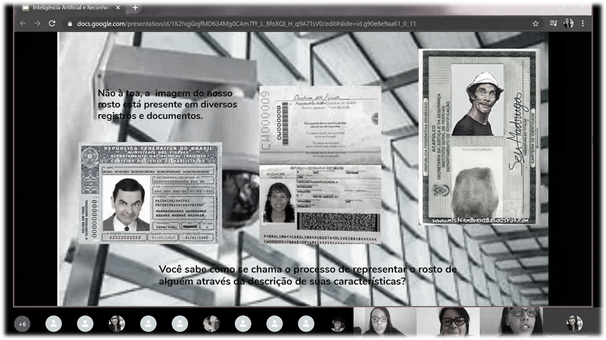
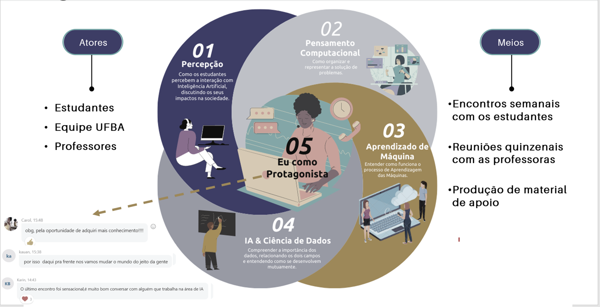

# Encantamento e capacitação de professores

## Encontros virtuais com professoras/es (Café com Dados)

Encontros virtuais abertos a professores e comunidade escolar das cinco escolas participantes do projeto, bem como toda a sociedade ocorreram através do Café com Dados.  Os encontros totalizaram uma carga horária aproximada de 40h, dividida em encontros de uma vez por semana, que duravam entre 1h a 1h30. As gravações dos encontros estão disponíveis no [site do projeto](https://cienciadedadosep.wixsite.com/cafecomdados), possibilitando, assim, que as discussões alcançassem pessoas que não estavam presentes nos momentos dos encontros. A primeira etapa, realizada de abril a julho de 2020, visou encantar e aproximar os professores e coordenadores das escolas ao tema de ciência de dados e suas relações com os demais temas (inteligência artificial, produção do conhecimento científico e protagonismos social, racial e de gênero). A segunda etapa ocorreu de agosto a outubro, no formato de mediações didáticas. Nestes encontros foram apresentados e discutidos os conteúdos trabalhados nos encontros virtuais com as/os estudantes liderados pela equipe do projeto. 

**Abril 2020**
Desmistificando a ciência de dados - Profa. Karla Esquerre / UFBA; Ciência de dados na Engenharia de transportes - Prof. Jorge Ubirajara / UFBA; Ressignificando os dados públicos sobre COVID-19: As iniciativas não governamentais - Fernando Barbalho / Tesouro Nacional; Testes diagnósticos para o COVID - 19 - Profs. Danilo Klein e Alexandre Silva / UERJ e Secretaria Extraordinária de Acompanhamento das Ações Governamentais Integradas do Covid 19 do Rio de Janeiro; Ferramentas online para suporte ao ensino - Ana Carolina Santos, Ana Luisa Nogueira, Janaina Souza, Thalita Senna e Profa. Karla Esquerre / UFBA.

**Maio 2020**

Ciência de dados na educação pública - Profa. Karla Esquerre / UFBA; Webinar: explorando um Design Universal de Aprendizagem em Programação; Pensamento Computacional - Geisa Santos / IAT; Jurimetria - Julio Trecenti; Ciência de Dados no esporte - Prof. Daniel Takata Gomes 

**Junho 2020**

Hackers na Educação - Profa. Karina Menezes / UFBA; Pesquisa em segurança pública em evidências: O caso das delegacias das mulheres - Prof. Sandro Cabral / UFBA - Insper; A robótica transformando a educação e as pessoas - Profa. Andrea Bittencourt / IFBA; Interpretando dados para compreender fenômenos biologicamente complexos-efeitos analgésicos de células-tronco - Profa. Cristiane Flora Villarreal / UFBA 

**Julho 2020**

Debatendo sobre gênero e diversidade - Profa. Maíse Zucco / UFBA; Refletindo sobre o campo dos estudos de gênero e as contribuições para uma educação inclusiva - Profa. Maíse Zucco / UFBA; A versatilidade de um cientista de dados - Gabriela de Queiroz IBM / IA Inclusive; Ações da Fundação Itaú Social na área de educação - Renato Brizzi / Fundação Itaú Social; Algoritmos e pandemia: Fatos biológicos e ficções culturais - Profa. Jamile Borges / UFBA; Educação para justiça social: Conceito e métricas - Icaro Bernardes / UFBA (Set 2020).

Contribuíram como palestrantes professores, profissionais, estudantes de graduação e pós-graduação compartilhando as suas experiências nas mais diversas áreas. Destaca-se a participação das professoras Alzira Melo e Érica Nascimento, do Colégio Estadual Henriqueta Martins Catharino e do Colégio Estadual Evaristo da Veiga, respectivamente, que apresentaram suas experiências ministrando a disciplina Introdução à Inteligência Artificial juntamente com a graduanda Ana Luisa Nogueira e a mestranda Laís Bastos, ambas bolsistas do projeto. A Figura \@ref(fig:cafe) apresenta um registro desse encontro. 


```{r cafe, fig.cap='Registro do encontro da disciplina Introdução à Inteligência Artificial em 01 de setembro, com o tema Reconhecimento Facial.', echo=FALSE, message=FALSE, warning=FALSE}

```

## Construção da disciplina Inteligência Artificial

Considerando a natureza eletiva de parte das disciplinas oferecidas no ensino médio, o Colégio Estadual Henriqueta Martins Catharino, na pessoa da professora Alzira Melo, propôs a oferta de uma disciplina na área de Ciência de Dados. De forma a atrair a atenção e interesse das/os estudantes, juntamente com a equipe do projeto foi proposta a disciplina de Inteligência Artificial. Além desse colégio, o Estadual Evaristo da Veiga, na pessoa da professora Érica Nascimento, propôs oferecer a mesma disciplina. Uma proposta de ementa foi elaborada no início de 2020.
A aproximação dessas professoras ao tema de Inteligência Artificial foi iniciada através da produção de textos/resumos baseados em artigos científicos, vídeos, reportagens e cursos relacionados a esses temas. Tal atividade foi conduzida por um membro do projeto vinculado à equipe de protagonismo. No total, foram elaborados 02 resumos baseados em vídeo conferências, 02 resumos baseados em artigos científicos, 01 resumo baseado em vídeo reportagem e 10 resumos baseados em reportagens de revistas e jornais online. As referências utilizadas para a produção dos resumos são apresentadas na Sessão Bibliográfica.  A lista de resumos é apresentada no Apêndice 12.2 e os resumos completos podem ser acessados no [Drive](https://drive.google.com/drive/folders/1J2h6ljxDrwNOSu66Wzr-V13JCXEHWzHv?usp=sharin).

Inicialmente, a equipe de Inteligência Artificial iria apenas apoiar as professoras e instituições na disciplina. No entanto, por ter que ser conduzida de modo virtual, foram percebidas as necessidades de adaptar a ementa inicialmente proposta para a quantidade de encontros previstos e para a dinâmica de um encontro virtual. Assim, ficou acordado que seriam realizados encontros semanais dentro do período de 18 de agosto a 24 de novembro de 2020. Aliado ao discurso das professoras que se mostraram inseguras em alguns pontos da liderança do encontro, também ficou definida a alternância quinzenal da liderança desses encontros com a equipe do projeto. Nos encontros liderados pelas professoras, passaram a ser abordadas as aplicações e implicações da inteligência artificial enquanto a equipe do projeto passou a se dedicar aos tópicos mais teóricos e conceituais. Nos encontros das professoras, elas utilizaram a experiência adquirida com a produção dos resumos para propor os temas e discussões dos seus encontros. Para a discussão dos tópicos e de eventuais dúvidas das professoras, também ficaram combinadas reuniões semanais ou quinzenais com as professoras e uso do grupo do WhatsApp para diálogos e compartilhamentos. A ementa da disciplina é apresentada no Apêndice 12.3.
As inscrições para a disciplina foram feitas através de um formulário do Google compartilhado com um card para divulgação da iniciativa. O link foi divulgado pelas professoras e coordenadoras entre os estudantes e foi divulgado pela equipe do projeto entre os estudantes bolsistas.
Ao todo, foram feitas 43 inscrições. Contudo, 20 estudantes nunca compareceram. Essas faltas foram averiguadas e, geralmente, apresentaram justificativas relacionadas à pandemia. Foi observada uma frequência máxima de 23 estudantes no encontro do dia 01/09/2020, e mínima de 11 estudantes no encontro do dia 13/10/2020, variando entre esses valores e entre os mesmos estudantes. Vale ressaltar que temos estudantes sem faltas.
Na Figura \@ref(fig:diagramaAI) é apresentada uma representação das discussões de Inteligência Artificial e a formação de futuros protagonistas de transformação da sociedade.

```{r diagramaAI, fig.cap='Discussão dos vários aspectos da IA e os resultados na formação de protagonistas de transformação da sociedade. Textos no extremo esquerdo: “obg pela oportunidade de adquirir (sic) mais conhecimento!!!”; “por isso daqui pra frente nós vamos mudar o mundo do jeito da gente”; “o último encontro foi sensacional, e muito bom conversar com alguém que trabalha na área de IA”.', echo=FALSE, message=FALSE, warning=FALSE}

```


## Construção de uma parceria com professoras/es do IAT

No dia 14/12/2020, a equipe de protagonismo realizou uma reunião com quatro professores e uma coordenadora de uma escola pública no interior da Bahia. A reunião teve como objetivo promover a escuta dos professores e levantar suas expectativas sobre parceria com Projeto Ciência de Dados na Educação Pública com vistas a elaborar proposta conjunta de ação para estimular o protagonismo juvenil em sala de aula segundo uma perspectiva transdisciplinar em suas respectivas escolas.
           Durante a reunião, as integrantes da equipe de protagonismo convidou os professores participantes a preencherem coletivamente e online um material contendo as questões abaixo: 
           
 - Qual a importância do protagonismo juvenil?
 - Por que o protagonismo juvenil deve ser inserido no currículo escolar?
 - Qual o perfil dos alunos com quem eu trabalho?
 - Quais as expectativas em relação ao trabalho em parceria com a equipe do Projeto Ciência de Dados na Educação Pública? 
 
 As respostas dos professores estão disponíveis neste  [link da pasta ](https://pad.riseup.net/p/CDnaEP).
Os professores manifestaram interesse em rever e dar nova roupagem a projetos já existentes na escola (ex. experiência da Aprendizagem Criativa), às disciplinas eletivas nas quatro grandes áreas (ex. Itinerário Formativos) e outras não eletivas. Há receptividade em relação ao engajamento e à formação dos demais professores para construir coletivamente as estratégias, ao invés de levar propostas prontas, definidas sem sua participação. 
Ao final, foi firmada a manutenção do contato dos professores com a equipe do projeto prevista para 2021, considerando a  manutenção do contexto pandêmico e incertezas das diretrizes do ensino nas escolas estaduais.