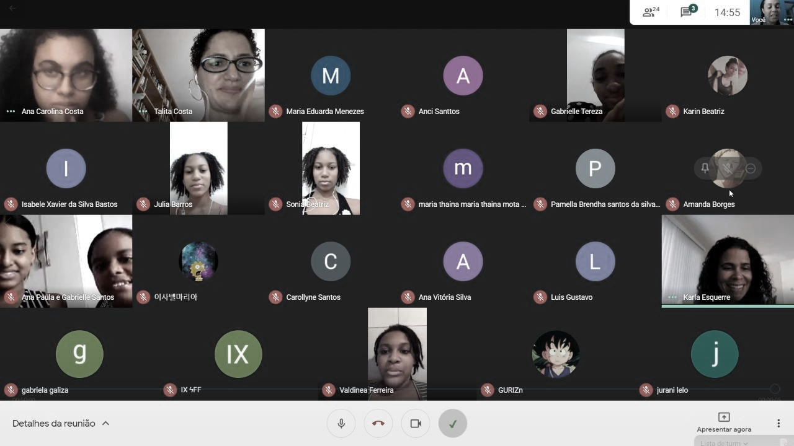
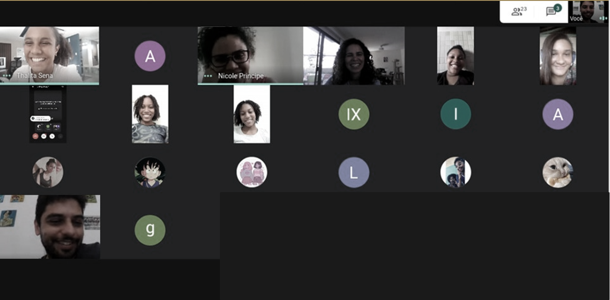
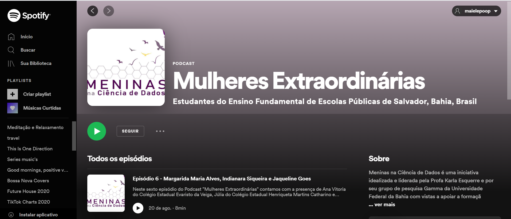
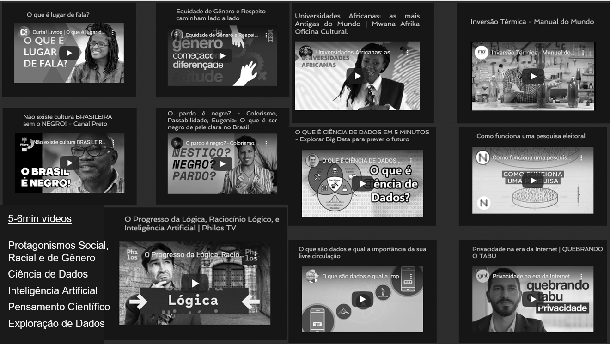
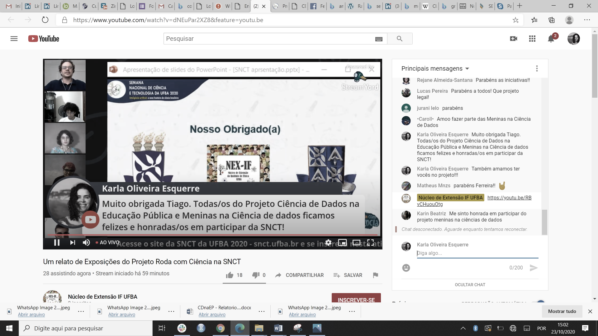

# Encontros virtuais com estudantes bolsistas {#encest}

<div class="capa">
<div class="foto_ativ">

</div>

<div class="leg_ativ">
Encontros virtuais
</div>
</div>

## Metodologia

A preparação do material para os encontros com as/os estudantes requereu a realização de pesquisa sobre o tema, a elaboração de slides, a discussão e elaboração de planos de aula, bem como a preparação de disparadores complementares (jogos, cards etc.). Para cada encontro, estima-se um tempo médio de dedicação da equipe correspondente a 8h.

A metodologia desenvolvida buscou a motivação e o engajamento das/os partícipes, tornando cada um/a protagonista do processo, através da mediação dos saberes.  A construção de saberes está baseada, especialmente, nas metodologias ativas, com o estímulo para que as/os estudantes aprendam através de desafios sobre temas atrelados à ciência de dados, inteligência artificial, conhecimento científico e questões transversais, como gênero, raça e sociedade. Assim, há um esforço da/o estudante para propor possíveis soluções para os problemas trazidos pelas/os facilitadoras/es de modo colaborativo, a fim de instigar um perfil crítico, reflexivo e investigativo, conscientizando a construção do conhecimento. 

Para o estudo de cada conteúdo, a/o estudante tem acesso antecipadamente a materiais – textos, vídeos, imagens, histórias em quadrinhos etc. - sobre o tema a ser apresentado a cada encontro. Tal atitude busca instigar dúvidas, despertar o desejo de pesquisar mais sobre o assunto, dialogar com as/os colegas, contribuindo, assim, para a formação de sujeitos que fazem a diferença em seu contexto social.

Assim, o trabalho se apoia na construção de saberes dialógica e processual e na intertextualidade de linguagens audiovisuais distintas (poesias, fotos, músicas, vídeos, textos, pinturas etc.).
Todo o material elaborado para apoiar as atividades com os estudantes pode ser acessado em [](https://cienciadedadosep.wixsite.com/estudantes).
Encontros semanais com as/os estudantes
Iniciadas em 23/03/20, por conta da pandemia, as reuniões virtuais com as estudantes bolsistas do projeto eram realizadas uma vez por semana, com duração média de 60 minutos, utilizando ambientes virtuais de discussão gratuitos, acessados através do aplicativo Hangouts (disponível para computadores, tablets, laptops e celulares). Os encontros reuniram aproximadamente 15 a 20 estudantes, distribuídas em quatro subgrupos, cada qual conduzido por uma estudante de graduação membro do projeto. Em três destes grupos, houve a participação regular de três professoras oriundas das escolas parceiras. Os temas abordados nestes encontros eram voltados para a discussão de mulheres extraordinárias que mudaram o Brasil e o mundo, em continuação a uma atividade bastante apreciada pelas estudantes e iniciada no segundo semestre de 2019 de forma presencial. Como fruto dessas discussões, Podcasts foram produzidos por estudantes e postados inicialmente no YouTube e recentemente no [Spotify](https://open.spotify.com/show/4hHoJYZVxVPOYrAT2OGuB8).
Em agosto/2020, as distintas frentes de trabalho passaram a compor equipes específicas, responsáveis por conduzir reuniões temáticas correspondentes com as estudantes, considerando os eixos: Produção do Conhecimento Científico, Inteligência Artificial, Protagonismo e Ciência de Dados. Em paralelo, a metodologia anterior de realizar reuniões online com as alunas em pequenos grupos, organizados por escola, foi substituída pela organização de um único grupo reunindo todas as estudantes bolsistas. 
A inclusão de estudantes do sexo masculino no projeto ocorreu também em agosto/2020, os quais não haviam participado do processo anterior de sensibilização das estudantes bolsistas. Assim, buscou-se estimular nas alunas uma postura receptiva e colaborativa diante dos recém-chegados, nos quais foram exercitados valores como respeito, cooperação, sensibilidade e adoção de posturas de combate às injustiças de gênero. Os conteúdos foram adaptados para promover a participação dos garotos nas discussões e entrosá-los aos demais colegas. Os ajustes se traduziram em uma nova abordagem sobre o protagonismo social, racial e de gênero, ampliando o foco anterior na atuação de determinadas figuras femininas para outros atores sociais.
Em 10/08/20, a equipe executora do projeto ampliou o tempo de contato/interação com os/as estudantes ao dar início à realização de duas reuniões semanais com as alunas, ao invés de apenas uma, como ocorria até o momento. Desde então, cada uma das cinco equipes de trabalho - o que inclui os profissionais responsáveis por organizar o site (Re)Conhecendo Salvador - se revezam na condução de encontros online com as/os estudantes. 
Esses marcos temporais são úteis para compreendermos as mudanças ocorridas na condução e na periodicidade das reuniões online. Assim, entre 23/03/20 e 10/08/20, os encontros online foram realizados semanalmente, em subgrupos separados por escolas, sendo conduzidos por quatro facilitadoras distintas. Entre 10/08/20 e 21/12/20, os encontros passaram a ser realizados três vezes por semana, reunindo todas as estudantes em um único grupo, conduzido por  2 ou 3 facilitadoras/es de cada equipe. Na Tabela \@ref(tab:quadro3) o número de encontros realizados por tema e sua associação com os e-books e site.  A lista dos temas dos encontros com as/os estudantes é apresentada no Apêndice 12.3.

```{r quadro3, echo=FALSE, message=FALSE, warning=FALSE}
library(dplyr)
library(kableExtra)
temas <-c("Protagonismo",
"Ciência de Dados",
"Produção do Conhecimento Científico",
"(Re)Conhecendo Salvador / Exploração Gráfica",
"Inteligência Artificial")

nencontros <-c("12 + 3","5","8","4","9")

capitassoc <- c(
"Assuntos abordados diretamente ou tangencialmente no E-book 4",
"E-book Ciência de Dados - Capítulos 1, 2, 6",
"E-book Produção do conhecimento científico - Capítulos - 1,2 e 3", 
"Site (re)Conhecendo Salvador - Temáticas: População, Turismo, Segurança Pública.",
"E-book Inteligência Artificial - Capítulos 1, 2, 3"
)

quadro3 <- data.frame(temas,nencontros,capitassoc)

names(quadro3) <- c("Temas","Nº de encontros","E-book e capítulo associado aos assuntos discutidos")

kbl(quadro3,caption = "Encontros realizados com as/os estudantes.")
```
*12 encontros realizados de março a julho e 3 encontros realizados de agosto a outubro. Encontros da disciplina Inteligência Artificial, mas abertos a todos os estudantes bolsistas. 4 estudantes bolsistas do ensino fundamental II participam deste curso.*


Nas Figuras \@ref(fig:meetenctprot) a \@ref(fig:meetenctsite) são apresentados alguns registros desses encontros.


```{r meetenctprot, fig.cap='Registro de um dos encontros com a equipe de Protagonismo.', echo=FALSE, message=FALSE, warning=FALSE, fig.show='hold',fig.align='center'}

```


```{r meetenctsite, fig.cap='Registro de um dos encontros com a equipe do site (re)Conhecendo Salvador.', echo=FALSE, message=FALSE, warning=FALSE, fig.show='hold',fig.align='center'}

```


## Produção de Podcasts: Mulheres Extraordinárias {#podcast}

O objetivo desta atividade consistiu em fortalecer o protagonismo das estudantes; estimulá-las a mediar o aprendizado para seus pares e envolvê-los, ainda que indiretamente, nas ações do projeto. 
Foi proposto às estudantes que, à distância, motivassem colegas (não vinculadas ao projeto) para produzir podcasts (áudios curtos passíveis de edição, disponibilizados via internet, dedicados a tratar de um tema específico) sobre as mulheres extraordinárias discutidas durante as reuniões do projeto, com base nos textos e pontos-chave elaborados pela equipe. 
Cada episódio do podcast aborda a vida de três diferentes mulheres extraordinárias através dos áudios enviados pelas estudantes. Os temas dos podcasts produzidos pelas estudantes em 2020 são apresentados no Quadro \@ref(tab:quadro4). Eles podem ser acessados no [Spotify](https://open.spotify.com/show/4hHoJYZVxVPOYrAT2OGuB8) (Figura \@ref(fig:podcast)).

```{r quadro4, echo=FALSE, message=FALSE, warning=FALSE}
library(dplyr)
library(kableExtra)

epsodios<- c("4","5","6","7")
datas <-c("03/06/2020",
"18/06/2020",
"20/08/2020",
"27/10/2020") 
mulhesextr <- c(
"Carolina Maria de Jesus, Antonieta de Barros e Maria Lenk",
"Dorina Nowill, Anne Frank, Graziela Maciel Barroso",
"Margarida Maria Alves, Indianara Siqueira e Jaqueline Góes",
"Sônia Guajajara, Malala, Djamila Ribeiro")

quadro4 <- data.frame(epsodios,datas,mulhesextr)

names(quadro4) <- c("Episódios","Data de publicação","Mulheres extraordinárias")

kbl(quadro4,caption = "Podcasts produzidos pelas estudantes durante o período de abril a outubro de 2020.")

```


```{r podcast, fig.cap='Podcast Mulheres Extraordinárias publicado pelas estudantes no Spotify. A edição dos áudios e as publicações no Spotify são de responsabilidade da estudante do 9º ano do ensino fundamental Maíra Oliveira Esquerre (voluntária).', echo=FALSE, message=FALSE, warning=FALSE, fig.show='hold',fig.align='center'}

```


## Encantamento do público escolar {#pubescol}

Uma preocupação contínua durante todo o projeto tem sido criar meios 
de encantar e apoiar a formação de toda a comunidade escolar, 
especialmente, estudantes, professoras/es e coordenadoras/es, das 
escolas participantes do projeto, e futuramente de outras escolas. 
Sendo o encantamento a etapa inicial e fundamental, uma nova 
estratégia foi proposta e realizada, considerando as limitações da 
pandemia.  A partir da segunda semana de agosto (dia 10), visando este 
público escolar das escolas participantes do projeto, a equipe do 
projeto passou a compartilhar diariamente vídeos curtos (de 5 a 6 
minutos de duração), disponíveis na internet e de fontes consideradas 
confiáveis, relacionados aos temas explorados nos encontros com 
estudantes e nos E-books em construção. Com isso, professoras/es e 
coordenadoras/es das cinco escolas participantes se responsabilizaram 
por compartilhar com suas/eus respectivas/os estudantes. Os vídeos 
estão disponíveis no [site do projeto](https://cienciadedadosep.wixsite.com/estudantes/videos) e 
foram compartilhados nos grupos de WhatsApp do projeto. Na Figura 
\@ref(fig:exemplosvideo)
são apresentados exemplos de alguns vídeos. As estatísticas de acesso 
aos vídeos não foram estimadas por falta de dados, visto que os vídeos se encontram em websites de acesso público.

```{r exemplosvideo, fig.cap='Exemplos de vídeos compartilhados com as/os estudantes e professores.', echo=FALSE, message=FALSE, warning=FALSE, fig.show='hold',fig.align='center'}

```

Visando acessar um público escolar ainda maior, além dos que fazem parte das cinco escolas que colaboram com o Projeto, a equipe colaborou de forma expressiva na Semana Nacional de Ciência e Tecnologia, promovida pela UFBA e realizada entre os dias 17 a 23 de outubro de 2020 - [(SNCT)](http://www.snct.ufba.br/programacao-semana-ufba/). Durante toda a semana, professores, estudantes e técnicos administrativos das diversas Unidades Acadêmicas da UFBA, de Salvador e Camaçari, bem como professores e estudantes da rede pública de ensino, estadual e municipal dessas cidades, participaram de encontros virtuais (palestras, mesas-redondas, bate-papos, etc) com o intuito de proporcionar discussões a respeito da Inteligência Artificial e temas afins.  
No Quadro \@ref(tab:quadro5) apresenta-se o calendário das apresentações lideradas pela equipe do Projeto, assim como o seu respectivo número de participantes. As apresentações podem ser acessadas no [Youtube.](https://www.youtube.com/playlist?list=PLdPylXX7C_XhxUyoDBxeEIOR0hbLNHbqX)

```{r quadro5, echo=FALSE, message=FALSE, warning=FALSE, fig.show='hold',fig.align='center'}

library(dplyr)
library(kableExtra)

datas<-c("19/10/20 10h30-11h40",
"19/10/20 15h-16h",
"19/10/20 16h-17h",
"20/10/20 17h-18h",
"20/10/20 16h-17h",
"20/10/20 17h-18h",
"21/10/20 17h-18h",
"22/10/20 14h-15:30h",
"20/10/20")


Tema <- c("Onde está a IA no dia-a-dia: Aplicações da Inteligência Artificial",
"O que é Inteligência Artificial e Jogos",
"O que é Ciência de Dados?",
"Exploração Gráfica – (re)Conhecendo Salvador (Parte 1 – Mapas, população e números)",
"Anedotas ou dados: como basear nossas conclusões?",
"Exploração Gráfica – (re)Conhecendo Salvador (Parte 2 – Gráficos e Estatísticas – Transporte, segurança e turismo)",
"Discriminação racial algorítmica",
"Projeto Científico na Prática",
"Protagonismo Feminino na Ciência de Dados")

equipe <- c(
"Inteligência Artificial",
"Inteligência Artificial",
"Ciência de Dados",
"(re)Conhecendo Salvador",
"Ciência de Dados",
"(re)Conhecendo Salvador",
"Protagonismo ",
"Pensamento Científico",
"Protagonismo")

partic <- c("60 / 14",
"30 / 12",
"26 / 11",
"24 / 10",
"23 / 10",
"16 / 6",
"24 / 12",
"37 / 14",
"22 / 11")

quadro5 <- data.frame(datas,Tema,equipe,partic) 

names(quadro5) <- c("Data",
"Tema",
"Equipe responsável",
"Número de participantes total / Estudantes do projeto"
)

kbl(quadro5,caption = "Seminários apresentados pela equipe na Semana Nacional de Ciência e Tecnologia da UFBA 2020.")
```


A Figura \@ref(fig:ondeestaAI) apresenta um registro da participação da equipe nos eventos: Onde está a IA no dia-a-dia: Aplicações da Inteligência Artificial e Projeto Científico na Prática. O primeiro contou com a liderança compartilhada das professoras Érica Nascimento e Alzira Melo, dos colégios Evaristo da Veiga e Henriqueta Martins Catharino e no segundo com a participação da estudante bolsista Isabele Xavier, do Colégio Ypiranga, que apresentou um relato da sua experiência ao elaborar o seu projeto apresentado na Feira de Ciências do Agreste Pernambucano. Esses encontros oportunizaram a equipe UFBA (graduandas/os e pós-graduandas) e das escolas (professoras e estudantes) a compartilharem a fala em um evento aberto ao público, organizado pela universidade. A Figura \@ref(fig:encerrSNCT), extraída da cerimônia de encerramento, destaca-se os relatos das estudantes presentes no ambiente do chat, em que declaram os seus sentimentos em participar do Projeto, e de uma estudante no formulário de inscrições. O Projeto Meninas na Ciência de Dados é um braço forte do atual Projeto. Ressalta-se a importância da participação dos estudantes em um evento organizado pela universidade, mesmo de forma virtual, pois para a maioria o acesso à universidade ainda é muito distante.


```{r ondeestaAI, echo=FALSE,out.width="49%",out.height="20%",fig.cap="Registro do encontro no tema Onde está a IA no dia-a-dia: Aplicações da Inteligência Artificial, liderado pelas professoras Érica Nascimento e Alzira Melo dos Colégio Evaristo da Veiga e Henriqueta Martins Catharino, respectivamente, e pela equipe e do encontro no tema Projeto Científico na Prática, liderado pela equipe e com a participação da estudante Isabele Xavier.",fig.show='hold',fig.align='center'}
knitr::include_graphics(c("images/image98.png","images/image99.png"))
``` 


```{r encerrSNCT, fig.cap='Registro da cerimônia de encerramento da SNCT. Com destaque o relato no chat das estudantes Caroll (Carollyne Dourado) “Amoo fazer parte das Meninas na Ciência de Dados” e Karin Beatriz (de Souza) “Me sinto honrada em participar do projeto meninas na ciências de dados” (esquerda) e o depoimento de um estudante no formulário de inscrições - informação compartilhada pela coordenação do evento; autoria não divulgada (direita).', echo=FALSE, message=FALSE, warning=FALSE, fig.show='hold',fig.align='center'}

```
