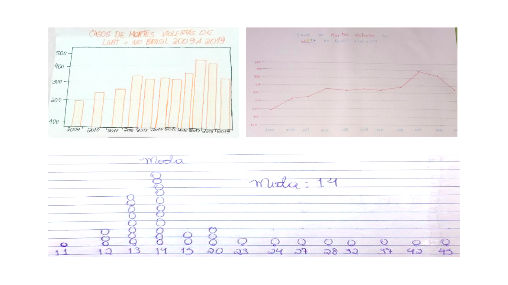

---
output:
  word_document: default
  html_document: default
---
# Avaliação de Impacto

Tratando-se da avaliação de impactos de projetos sociais é fundamental estabelecer quais os resultados esperados, métricas e instrumentos para verificar o status deles e métodos para contornar vieses. A teoria da mudança é um método que facilita a construção de uma cadeia de elementos que parte dos insumos necessários para as atividades de um projeto e chega até os efeitos estimados no público-alvo. Métricas devem ser relevantes para o público-alvo, tão fáceis quão possível de obter e precisas no que estão medindo. Além disso, é importante ponderar que podem haver características não-observadas no público alvo e que afetam as métricas escolhidas (INSPER METRICIS, 2018).
Os principais resultados que esperamos observar como consequência das atividades que as/os estudantes participaram são: 

 (a) estudantes ganham instrumentos na luta contra a desigualdade, 
 (b) estudantes adquirem novas perspectivas e habilidades socioemocionais e 
 (c) estudantes adquirem habilidades de letramento científico e em dados.

**A avaliação dos impactos do Projeto está sendo construída. Neste relatório são apresentadas percepções com base qualitativa obtidas a partir dos encontros com as/os estudantes e professoras/es e dos materiais produzidos por eles. Para mensurar tais resultados foram planejadas avaliações qualitativas e quantitativas cujos resultados são apresentados no relatório anual.** 
Os professores também tomaram parte em atividades no Projeto, entretanto a pandemia demandou uma mudança de planos da equipe. A intenção inicial para o ano de 2020 era maior foco no contato com os professores para que ferramentas da ciência de dados e questões sobre protagonismos social, racial e de gênero foram integradas aos conteúdos discutidos em sala de aula. Uma vez que a quarentena impediu a realização de aulas presenciais e até mesmo à distância nas escolas, a atividade liderada pelos professores não foi realizada como esperado. Não obstante, duas professoras, passaram a ministrar a disciplina de Inteligência Artificial para estudantes do ensino médio de suas respectivas escolas, e passou a ministrar palestras em eventos públicos sobre o tema. Elas têm sido exemplos de lideranças para as/os demais professoras/es.

## Percepções com base qualitativa

### Questões sociais

As/os estudantes demonstraram uma percepção mais aguçada em relação a questões sociais ao longo dos encontros realizados no ano. Assim, atas das reuniões semanais contendo impressões da equipe e paráfrases do que foi dito pelas/os alunas/os evidenciam essa habilidade adquirida. É importante notar que as/os estudantes desconheciam ou tinham pouca ciência acerca da atuação decisiva das mulheres em diversos campos de atuação, o que destituiu a ideia fabricada pela sociedade patriarcal que marca o local feminino em áreas estritamente ligadas ao cuidado ou ainda a concepção de mulheres como donas de casa, mães, esposas... Por isso, ao serem apresentadas a mulheres (chamadas de extraordinárias) atuando em diversas áreas, em diferentes contextos sociais, geográficos, culturais e de época, o construto do papel da mulher na sociedade passou a ser questionado e deslocado. Foi imprescindível para garotas perceberem que elas podem assumir o papel de protagonistas nas mais diversas áreas, inclusive destituindo o que imaginavam para si, reproduzindo os papéis desenvolvidos por familiares, especialmente mães e avós, sem muitas perspectivas de subversão da realidade. É importante salientar que as garotas partícipes do projeto são de comunidades em condição de vulnerabilidade social, nas quais, as mulheres ainda são vistas sob a égide do patriarcado.   
Em um encontro que tratou do esforço para garantir a acessibilidade a deficientes visuais, foi apresentada a educadora e ativista Dorina Norwill, as/os estudantes foram além do escopo das perguntas orientadoras. Eles pensaram a acessibilidade de uma escola para além da estrutura física e chamaram a atenção para a importância de “que elas (deficientes visuais) socializem e não sejam excluídas e que deviam frequentar a mesma escola”. Uma das estudantes acrescentou “que se deve evitar o bullying”.
Em outro encontro, tratando da adolescente alemã, vítima do holocausto, Anne Frank e o diário que ela escreveu relatando suas experiências em meio à guerra os estudantes foram capazes de associar as ameaças do passado com os problemas do presente. Apesar de Anne Frank ter sido uma menina perseguida na Europa devido à sua etnia e cultura judaica, as/os estudantes chamaram a atenção para pessoas podem ser perseguidas por “seguir uma religião”, por ser homossexual ou por não gostar de uma opinião política, por exemplo.
As/os estudantes também manifestaram perceber como a representação dos negros pode reforçar estereótipos. Em um encontro (24/04) sobre Ruth de Souza, atriz negra e ativista, uma das estudantes criticou um papel que a atriz assumiu representando uma escrava. A estudante afirmou que “papéis como esse dão a ideia de que todo negro é escravo”.
Uma estudante também demonstrou perceber de maneira intuitiva parte do conceito de interseccionalidade. Ao ser indagada sobre diferenças como o machismo incide sobre mulheres negras e brancas ela indicou que “mulheres negras sofrem machismo e racismo ao mesmo tempo”.
Diversas estudantes relataram experiências de racismo em primeira mão, seja como vítimas ou testemunhas, adotando uma postura empática, algumas até buscaram trazer os agressores à luz do conhecimento.
O destilado dos vários aprendizados das/os estudantes foram os glossários coletivos. Esses documentos apresentam definições de palavras importantes para entender as questões sociais, raciais e de gênero. Tal documento foi uma construção coletiva baseado nas dúvidas e na pesquisa prévia realizada pelas estudantes. A elaboração foi feita em uma plataforma visível para todos. Algumas palavras definidas pelas/os estudantes foram:  branquitude, matriz de dominação, representatividade e homem universal.

### Letramento científico e em dados

Os encontros das equipes de Ciência de Dados, do Site e Produção do Conhecimento Científico foram estruturados de forma que os objetivos fossem explícitos nos relatos das equipes em ata. Esses documentos indicam que objetivos foram considerados pela equipe como alcançados com sucesso.

Em termos de letramento científico, foi relatado que as/os estudantes:

 - Demonstraram interesse na discussão sobre onde, como e quem faz ciência;
 - Aqueles que tiveram experiência anterior com projetos científicos se empolgaram em compartilhar sua experiência com os colegas;
 - Participaram de atividades de formulação de problemas, levantamento de hipóteses de solução e estratégias para testá-las;
 - Discutiram métodos (entrevistas, observações, etc.) de coleta de dados e ferramentas (livros, balanças, etc.) para tal. Bem como estabeleceram um cronograma de ações.
 
 Em termos de letramento em dados, foi relatado que as/os estudantes:
 
 - Tiveram facilidade e curiosidade para identificar e analisar os elementos de mapas e gráficos apresentados sobre a cidade de Salvador;
 - Puderam perceber tempo, espaço e transformação de um local da cidade através da apresentação de fotos;
 - Interpretaram com facilidade e discutiram coletivamente elementos como o padrão de cores dos mapas, a importância da legenda, os diferentes tamanhos e cores das regiões e dos círculos nos mapas;
 - Confrontaram opiniões prévias que tinham quanto à proporção de estudantes matriculados do sexo feminino e masculino com dados coletados e foram capazes de incorporar as informações novas às suas noções;
 - Foram capazes de sugerir mudanças relevantes para aprimorar os gráficos de matrículas apresentados como: padrão das cores, escala mais exata, aumento da fonte da legenda, uso das tabelas, etc.;
 - Algumas/ns estudantes demonstraram interesse, discutiram e construíram análises sobre os sistemas de notificação de infrações de trânsitos de Salvador e perceberam a mudança de comportamento do número de ocorrências desses eventos por meio de gráficos (barras e boxplot), bem como os recortes temporais que os colocam frente ao momento da pandemia;
 - A compreensão da importância do turismo gerou curiosidade sobre estratégias de identificação de padrões como a exploração da intensidade de cores e reordenação de informações do domínio temporal de estrutura linear para o modelo de blocos periódicos. Assim, eles reconheceram os meses do ano que há mais ocupação da rede hoteleira e reconheceram a quebra de padrão como os eventos especiais como Copa do Mundo e pandemia;
 - Aprenderam o significado de medidas centrais (média, moda, etc.) e de dispersão (amplitude, desvio padrão, etc.) em um contexto mais próximo (idade dos colegas);
 - Foram expostos aos conceitos de população, amostra, intervalo de confiança, aleatoriedade e margem de erro através do tema de pesquisas eleitorais. Os conceitos de inferência estatística e intervalo de confiança foram reforçados através de uma atividade lúdica;
 - As manifestações de algumas/ns estudantes revelam indícios que houve o processo introdutório do letramento em dados, as perguntas geradas por informações anteriormente não citadas nos encontros, a abordagem de problemas com base em evidências são algumas das formas percebidas. 


As/os estudantes também realizaram tarefas de casa que envolviam representação gráfica, cálculo de medidas e reflexão sobre dados. Elas/es passaram a reconhecer a importância das grades em um gráfico, mas mantendo uma parcimônia para não tornar a figura cheia (ver Figura 19, superior esquerda), bem como a importância da legibilidade dos eixos e a escolha de um padrão de cores para informações que correspondem a mesma categoria. Nessa atividade, surgiram diferentes métodos de representação da informação; a Figura \@ref(fig:exercestud) (superior direita) mostra um bom exemplo. Nessa figura também se destaca a simplicidade e elegância da representação, bem como o uso inteligente de cores no título do gráfico como maneira de comunicar facilmente o tema apresentado. Em outra atividade, as/os estudantes calcularam medidas centrais das idades de colegas. Um estudante incluiu intuitivamente em sua resolução um gráfico de pontos ou dot-plot para identificar a moda (ver Figura \@ref(fig:exercestud), inferior).

```{r exercestud, fig.cap='Gráficos produzidos pelas/os estudantes.', echo=FALSE, message=FALSE, warning=FALSE}

```

Em essência, as/os estudantes puderam começar a assumir propriedade de conhecimentos e habilidades em letramento científico e em dados. A teoria foi apresentada em conjunto com atividades práticas para reforçar os conceitos. Apesar de suas dificuldades com a matemática, as/os estudantes foram capazes de compreender os conceitos por trás de fórmulas. Elas/es demonstraram facilidade de entender, discutir e produzir representações gráficas comuns. Além disso, foram capazes de incorporar informações recuperadas de dados (fotos e gráficos) em discussões.

### Ciência de dados como instrumento

Apesar das/os estudantes terem amadurecido sua capacidade de lidar com dados, sua percepção da Ciência de dados como um instrumento não foi instantânea.
Em um dos encontros em abril, um dos temas discutidos foi como a Ciência de dados estava sendo utilizada para trazer à luz questões sobre Anne Frank. As estudantes demonstraram ter alguma noção sobre o poder elucidativo dos dados isto é “para encontrar as pistas é preciso dados”. Todavia uma delas indicou que ainda não havia percebido mais concretamente esse uso até aquele encontro. Respostas dessa natureza se repetiram em outros encontros seguintes quando um elo entre a Ciência de dados ou a Inteligência artificial era estabelecida com elementos da vida cotidiana (em maior ou menor grau).
Mais tardiamente, em setembro foi proposta uma atividade em que as/os alunos deveriam indicar “Como a ciência de dados pode ajudar a melhorar a sua cidade, seu bairro ou a sua comunidade?”. Algumas/uns estudantes elencaram problemas de segurança, saúde, educação, divulgação científica e outros temas, bem como chamaram a atenção para a importância de dados para que entes do Estado e do setor privado possam tomar “decisões mais acertadas”.
Outras/os estudantes foram além e esboçaram uma cadeia de informações a medir com um propósito claro. Uma estudante propôs coletar dados sobre os locais onde há maior escoamento de esgoto e onde ele não é encanado para em seguida enviar equipes em tais locais. Um estudante sugeriu que, para lidar com os problemas de segurança em seu bairro, poderia coletar “quantas pessoas acordam cedo e ver os lugares onde elas passam para pôr câmeras ou iluminação”. 

### Novas perspectivas e habilidades socioemocionais

Uma das expectativas da equipe do Projeto era que as atividades afetassem a percepção dos estudantes de si mesmo e despertam novas habilidades socioemocionais neles.

#### Iniciativa {-}

No encontro que tratava das dificuldades sofridas por deficientes visuais uma das estudantes sugeriu “fazer uma dinâmica com os colegas, com eles sem ver. Após isso, propor uma discussão”. Diante das informações apresentadas no encontro a estudante demonstrou iniciativa para multiplicar o que havia aprendido e fazer isso de maneira que promovesse empatia nos colegas.


#### Determinação {-}

A prolongada quarentena afetou bastante as/os estudantes. Houve relatos ocasionais de desgaste devido à rotina muito ociosa. Todavia, a maioria dos estudantes perseveraram em diversas atividades. Em 16 encontros realizados de agosto a outubro apenas 4 dos 29 bolsistas tiveram quatro faltas não justificadas. Membros da equipe testemunham que as/os estudantes encaravam os encontros com boa expectativa. Em situações de desânimo das/os discentes, a equipe se esforçou para identificar tais situações fazendo um acompanhamento sistemático dessas/es estudantes, com diálogos individuais promovidos pela psicóloga ou psicopedagoga da equipe. Ainda em abril, quando discutiam sobre Anne Frank, as estudantes foram questionadas quanto ao interesse em escrever um diário, o que foi acolhido e houve interesse em registrar suas experiências em meio à pandemia. Ao fim de julho, uma oportunidade surgiu para que publicação de textos sobre o tema na Revista Jovens Cientistas da UFBA, a qual as estudantes aderiram.

#### Representatividade {-}

No encontro que tratou sobre a atriz Ruth de Souza e sobre o espaço na mídia dado aos negros, as/os estudantes expressaram que negros tinham espaço limitado de atuação e participação em publicidade, ainda que percebessem certas mudanças recentes nesse cenário. O debate desembocou na questão da representatividade e, depois de elucidadas algumas dúvidas, uma estudante afirmou que tinha interesse na área de veterinária ou computação, mas não conhecia tantos profissionais negros nesses espaços. A estudante e uma colega citaram que o Projeto “tem mostrado outros personagens e que é importante mostrar”. Além disso elas indicaram que isso “gera uma mudança na forma de se ver e ser representada”.

#### Ser agente de transformação {-}

Ainda no encontro sobre a atriz Ruth de Souza, os estudantes foram indagados sobre como discutiriam representatividade da mulher negra nos meios visuais e digitais caso tivessem um espaço para propagar suas ideias. As propostas foram diversas. Duas estudantes sugeriram pesquisa sobre mulheres negras no passado e presente e como é importante não “seguir um rótulo que são dados a elas”, bem como “mostrar exemplos de mulheres negras empoderadas”. Em outra oportunidade, em um encontro tratando sobre a sambista Dona Ivone Lara e sobre o sexismo dos papéis atribuídos a homens e mulheres na sociedade uma das estudantes relatou que suas amigas não entenderam a adesão dela ao Projeto pois “engenharia é coisa de homem”. Em uma outra conversa, as amigas passaram a ter opinião mais neutra, salientando que “cada um decide o que quer fazer”. 


Essa percepção quanto ao futuro na área de tecnologia e como agende de transformação pode ser observado na entrevista sobre Mulheres na Tecnologia realizada em 13 de outubro para a [TV Bahia](https://web.facebook.com/watch/live/?v=352188306002397&ref=watch_permalink, minuto 23), que teve a participação da estudante Ana Vitória de Jesus do Colégio Evaristo da Veiga (ver Figura \@ref(fig:transmosaic)), da estudante de graduação e bolsista do projeto, Ana Luísa Nogueira, da coordenação deste projeto e da coordenadora de produção criativa do Instituto Anísio Teixeira, Geisa Santos.
Apesar de jovens, a mesma estudante Ana Luísa Nogueira e a pós-graduanda Julia Bijos, passaram a participar ou liderar ações de lideranças voltadas para a inclusão das mulheres na área de tecnologia e ciência de dados, respectivamente. Ana Luísa foi uma das 24 selecionadas, dentre 450 candidatas, para participar do Industriy4her e Julia participou da organização do congresso Women in Data Science 2020.
Por fim, a Figura 21 exibe um conjunto de palavras-chave que representam as discussões abordadas pela equipe de Protagonismo nos dois anos do Projeto. Um glossário de novos vocábulos foi construído pelas estudantes sob orientação da equipe do projeto (ver Apêndice 12.5).

```{r transmosaic, echo=FALSE,out.width="49%",out.height="20%",fig.cap="TV Bahia entrevistando a estudante Ana Vitória de Jesus para a reportagem Mulheres na Tecnologia (superior), participação da Ana Luísa Nogueira no Industry4her (inferior esquerda) e da Julia Bijos na organização do evento Women in Data Science 2020 (inferior direita).",fig.show='hold',fig.align='center'}
knitr::include_graphics(c("images/image124.png","images/image36.png",
                          "images/image37.png","images/image38.png"))
```


```{r mixword, echo=FALSE,out.width="100%",out.height="80%",fig.cap="Nuvem de palavras (2019) e (2020) – Assuntos abordados pela equipe de Protagonismo.",fig.show='hold',fig.align='center'}
knitr::include_graphics(c("images/image39.png"))
```


## Percepção com base quantitativa

Ao fim de abril de 2020, 19 das 26 estudantes bolsistas vinculadas ao projeto desde o início desse ano responderam a um questionário semiestruturado com o objetivo de identificar, por meio de auto declarações ou situações-problema, as habilidades e conhecimentos adquiridos. O questionário está organizado em dez seções, similar à sua versão aplicada em 2019, contém questões adicionais e será repetido ao fim do calendário de atividades. Apesar da amostra não ser representativa do ponto de visto estatístico, as respostas obtidas nos permitem conhecer a realidade das estudantes, avaliar as ações realizadas e definir novas ações e estratégias visando um atingir um público ainda maior. 
Em relação à autodeclaração das estudantes quanto à cor da pele/raça, 95% se percebem como negras ou pardas. No que se refere à religião, aproximadamente 47% afirma ser evangélica e 30% católica. Além disso, há uma predominância feminina no lar, 90% moram com a mãe ou com a avó, em contraste com 42% moram com o pai. 
No que consta à dedicação de tempo ao estudo fora da escola, pouco mais de 70% não têm ocupação extraescolar. Entre aquelas que possuem ocupação, 60% fazem algum curso extra escola. 80% afirmam estudar 1h ou mais fora da escola. 56% afirmam estudar assuntos por iniciativa própria, além dos conteúdos aprendidos em sala de aula; e apenas 22% afirmam ter concluído algum curso online.
Quando perguntadas o que são ciências exatas, 60% afirmam não ter certeza e apenas 37% afirmaram que possuem algum conhecimento sobre o assunto. A Figura @\ref(fig:profestu) sintetiza as respostas relacionadas às carreiras que acreditam fazer parte das ciências exatas. Apesar da predominância das respostas incluindo Ciência de Dados, 21% acreditam que ciências exatas só envolvem problemas matemáticos. Por um lado, este resultado aponta para o não reconhecimento do uso da “matemática” aplicado a outras disciplinas ou ao seu cotidiano. Entretanto, elas reconhecem a importância da matemática para algumas carreiras nas áreas social e de saúde, como demonstra a Figura \@ref(fig:nivprofestu).

```{r profestu, echo=FALSE,out.width="100%",out.height="80%",fig.cap="Profissões que estudantes creem fazer parte das ciências exatas.",fig.show='hold',fig.align='center'}
knitr::include_graphics(c("images/image40.png"))
```


```{r nivprofestu,echo=FALSE,out.width="100%",out.height="80%",fig.cap=" Níveis de importância atribuídos pelas estudantes à matemática em diferentes profissões.",fig.show='hold',fig.align='center'}
knitr::include_graphics(c("images/image41.png"))
```

Quase 70% das estudantes afirmam conhecer exemplos de mulheres nas ciências exatas. Entre essas estudantes, 60% informou ter obtido tal informação na Internet. Acredita-se que esta resposta tenha relação com as referências nas aulas propostas pelo projeto. 70% das estudantes referem conhecer pessoalmente alguma mulher que trabalha com ciência de dados e 92% desse grupo afirmam se tratar de alguma professora.
50% das estudantes acreditam ser importante ter mulheres trabalhando na área de exatas e 80% acredita que elas oferecem uma contribuição significativa para essa área. Todas acreditam que as mulheres têm capacidade para contribuir de forma equivalente aos homens. A Figura \@ref(fig:carreirasestu) apresenta as futuras carreiras escolhidas pelas estudantes. Pouco mais de 20% das respostas correspondem à perspectiva clássica de ciências exatas, pouco mais de 30% às carreiras ligadas às áreas de saúde.


```{r carreirasestu,echo=FALSE,out.width="100%",out.height="80%",fig.cap="Carreiras que as estudantes acreditam que podem seguir.",fig.show='hold',fig.align='center'}
knitr::include_graphics(c("images/image42.png"))
```

No intuito de identificar se as estudantes compreendem que a Ciência de dados se articula a diversas carreiras, propusemos uma situação problema relacionando diferentes habilidades de raciocínio lógico e método científico às suas futuras escolhas profissionais. No problema, uma estudante hipotética se propõe a ajudar as pessoas a fazer um avião de papel manter-se no ar o maior tempo possível. Nesse cenário, elas adotariam as seguintes ações:
Testar diferentes tipos de papel e formas de dobrar, isto é, propor uma ideia para explicar as coisas e testar se essa ideia faz sentido;
Entender se existe relação entre o tempo de voo e número de dobras na folha, isto é, obter dados e ver se eles explicam um problema que se quer resolver;
Escrever um passo-a-passo detalhado para quem nunca fez aviões poder fazer um igual ao seu, ou seja, fazer um conjunto detalhado de instruções para fazer uma atividade (algoritmo).
A Figura \@ref(fig:habilidades) apresenta as porções de estudantes que escolheram as habilidades ou acreditam que nenhuma delas seria útil para sua carreira futura. Como elas poderiam escolher mais de uma, as barras não somam 100%. Os resultados sugerem que as estudantes têm uma noção mais ampla do que significa uma carreira envolver “habilidades das ciências exatas”, se comparada ao senso comum. 


```{r habilidades,echo=FALSE,out.width="100%",out.height="80%",fig.cap="Habilidades de raciocínio lógico e método científico que as estudantes acreditam ser importantes para suas futuras carreiras.",fig.show='hold',fig.align='center'}
knitr::include_graphics(c("images/image43.png"))
```

No tocante às desigualdades sociais, a maioria das estudantes se considera capaz de melhorar algum aspecto da condição de vida das pessoas ao seu redor, embora efetivamente não o faça (Figura \@ref(fig:nivpares)). Para as estudantes, a igualdade entre raças parece ser mais importante do que a igualdade de gênero (Figura \@ref(fig:nivgrupos)). Este aspecto precisa ser investigado, pois pode estar associado à dificuldade de entender a diferença entre igualdade e equidade, bem como a aspectos religiosos.


```{r nivpares,echo=FALSE,out.width="100%",out.height="80%",fig.cap="Nível de identificação das estudantes com afirmações sobre ações e a capacidade de trabalhar para o bem de seus pares.",fig.show='hold',fig.align='center'}
knitr::include_graphics(c("images/image44.png"))
```


```{r nivgrupos,echo=FALSE,out.width="100%",out.height="80%",fig.cap="Nível de identificação das estudantes com afirmações sobre a importância da igualdade entre diferentes grupos.",fig.show='hold',fig.align='center'}
knitr::include_graphics(c("images/image45.png"))
```


Para estimar a percepção das estudantes sobre sua própria tenacidade, foi utilizado um conjunto de questões advindas de um questionário já validado (Duckworth, acessado em outubro de 2020). Conforme apresentado na Figura \@ref(fig:nivtena), a maior parte das estudantes adotou uma resposta neutra em quase todas questões. Uma maioria expressiva afirmou que seus interesses mudam de ano em ano. Esta informação reafirma a importância de mantermos as ações de encantamento das estudantes. Felizmente, uma porção razoável de estudantes se identifica com as afirmações de que não se desencorajam com problemas e que já superaram alguns para conseguir algo importante.


```{r nivtena,echo=FALSE,out.width="100%",out.height="80%",fig.cap="Nível de identificação das estudantes com afirmações sobre sua 'garra', tenacidade.",fig.show='hold',fig.align='center'}
knitr::include_graphics(c("images/image14.png"))
```

Um dos efeitos esperados das atividades do projeto sobre os estudantes é o fortalecimento das habilidades socioemocionais, a exemplo da determinação. O prolongamento da quarentena tem afetado as comunidades escolares. Diretores, professores e coordenadores relataram dificuldade em manter contato com as estudantes e seus pais e/ou responsáveis. Todavia, a equipe do Projeto conseguiu evitar a evasão dos alunos bolsistas, integrou estudantes do sexo masculino às ações e aumentou a frequência dos encontros online. A Figura \@ref(fig:quaseman) apresenta a quantidade de estudantes ativos nesses encontros (participando ou respondendo as atividades propostas).


```{r quaseman,echo=FALSE,out.width="100%",out.height="80%",fig.cap="Quantidade de estudantes ativos (presentes ou que realizaram as atividades) nos encontros semanais.",fig.show='hold',fig.align='center'}
knitr::include_graphics(c("images/image16.png"))
```

A Figura \@ref(fig:sitevisita) **(talvez precise atualizar)**
apresenta o número de acessos diários ao website do Projeto. 
Verifica-se que este número aumentou substancialmente a partir de 
10/08/20 – período caracterizado pelo aumento da quantidade de 
encontros virtuais com as/os estudantes (de 1 para 2 ou 3 
vezes/semana), inclusão dos temas Ciência de Dados, Exploração 
Gráfica, Pensamento Científico e Inteligência Artificial, além da 
manutenção dos encontros do tema Protagonismos. Adicionalmente, vídeos 
passaram a ser compartilhados com professores e gestores das escolas 
para divulgação entre os estudantes (ao menos para aqueles com acesso 
a comunicação virtual).  Durante as duas últimas semanas, ocorreu uma 
queda no acesso ao website, o que pode estar relacionado à pausa nos 
encontros realizadas para organização e participação da equipe e 
das/os estudantes na Semana Nacional de Ciência e Tecnologia promovida 
pela UFBA. Ressalta-se, entretanto, que as presenças e participações 
nos encontros permaneceram estáveis em todo o período.   


```{r sitevisita,echo=FALSE,out.width="100%",out.height="80%",fig.cap="Número de acessos ao website do Projeto, em 10/08 o número de encontros com as/os estudantes foi ampliado de 1 para 2 ou 3 encontros semanais.",fig.show='hold',fig.align='center'}
knitr::include_graphics(c("images/image17.png"))
```

Com base no banco de dados do site, é possível afirmar que a maioria dos acessos ocorre utilizando-se aparelhos com sistema operacional Android (52%). Os acessos via sistema operacional de Windows representam 34% e 14% através IOS ou Linux.    
Para verificar se as/os estudantes adquiriram habilidades de letramento científico e em dados, a equipe prevê aplicar um teste. Entretanto, os testes validados dessa natureza não estão disponíveis em português (LAW et. al., 2018), sendo necessário confirmar, por meio de uma pequena amostra, se o significado das perguntas é preservado nas traduções (TSANG et. al., 2017). 
Para contornar tais desafios, serão aplicadas questões selecionadas de testes traduzidos para o português que avaliam uma noção moderna da matemática, a exemplo do PISA (OECD, 2021) e MARS (MARS, acessado em outubro de 2020). Em paralelo, será utilizada uma questão apresentada às estudantes em um questionário ao fim de 2019 (ver Apêndice 12.6). A reprodução dessa questão visa tornar os desempenhos dos alunos comparáveis, e outra nova será inclusa. Espera-se que dado o longo tempo as estudantes não tenham lembrança da questão e seu desempenho seja resultado exclusivo do crescimento no ano de 2020. Essa estratégia se ancora em um estudo de Wood (2019) no qual 130 respondentes fizeram um exame de 36 questões em duas oportunidades espaçadas e tiveram crescimento de desempenho similar para questões repetidas e não-repetidas.
