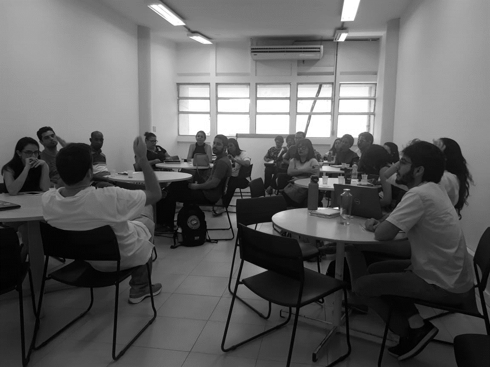

# Avaliação geral de impacto {#avalgeralimpact}

<div class="capa">

<div class="foto_ativ">

</div>

<div class="leg_ativ">
Representação da avaliação de impacto
</div>

</div>

## Introdu\c{c}\~ao {#intro}

As atividades de um projeto social precisam ser avaliadas com critérios transparentes e próximos da realidade. A avaliação permite uma melhor gestão do projeto e traz informações à comunidade sobre o andamento do mesmo. Boas métricas devem ser baratas, próximas da realidade e mensurar elementos que tenham uma clara relação com objetos do interesse do público-alvo. A Teoria da Mudança auxilia na escolha das métricas. Esse método auxilia o analista a associar as atividades e seus efeitos em uma cadeia de eventos. A certos efeitos associa-se uma métrica e desenha-se um método para medi-la. Apesar da simplicidade do método, não são incomuns empecilhos na sua execução.
Em 2020, o projeto Ciência de Dados na Educação Pública foi desafiado de várias formas. A pandemia foi a principal fonte de problemas e estes também afetaram os movimentos de avaliação de impactos. A mudança do ambiente presencial para o digital dificultou a aplicação de questionários de opinião e atividades avaliativas. Tal problema foi enfrentado concentrando as avaliações tanto quanto possível, alertando aos estudantes antecipadamente da importância de participar e valendo-se da experiência adquirida pela equipe ao longo do ano no ambiente virtual. Outro inconveniente foi a necessidade de adaptar e redefinir o calendário de atividades para acomodar novas oportunidades que surgiam e seguir o plano original tanto quanto possível. Em resposta, as métricas escolhidas para a avaliação de impacto tiveram de ser genéricas o suficiente para contemplar o conjunto de atividades esperado do projeto.
A despeito das dificuldades, foi possível aplicar as atividades e questionários com sucesso. As seções seguintes esclarecem como foram construídos e aplicados os formulários (Método), apresentam e discutem os resultados (Resultados) e indicam o que foi possível observar como resultado dessa experiência (Conclusão).

## Método {#metodo}

Ainda no início de 2020 foi elaborado uma Teoria da Mudança correspondente às atividades planejadas para o ano (ver Anexo \@ref(teoriadamudanca)). A maioria dos efeitos seriam medidos através de questionários de opinião. Assim, o questionário em papel aplicado em 2019 para grande parte das estudantes das escolas foi modificado para incluir questões que pudessem medir tais efeitos (uma cópia que pode ser respondida está acessível em: [](https://forms.gle/QP9crYYY6x1XhF7RA)). O questionário modificado foi aplicado em duas ocasiões: no início do calendário de atividades (de 30/04 até 06/05) e ao fim (30/10 até 01/11). Os estudantes receberam o link para responder ao questionário através dos canais de comunicação da equipe. Para tornar a experiência menos sisuda, o questionário foi respondido em um ambiente que simula uma conversa de texto com um robô.


```{r impacto01,echo=FALSE,out.width="100%",out.height="80%",fig.cap="Tela do ambiente que simula uma conversa com um robô.",fig.show='hold',fig.align='center'}
knitr::include_graphics(c("images/Impactos/01.png"))
```

O outro instrumento de medição foram avaliações produzidas em colaboração com as equipes 
(os acesso aos formulários das atividades está disponível no Anexo \@ref(atividadefix)). Em um primeiro momento pesquisou-se que habilidades e conhecimentos são esperados de um estudante nas áreas cobertas pelo projeto. Uma vez que tais temas não fazem parte em sua integridade de um currículo escolar comum buscou-se arcabouços produzidos por entes ligados ao mercado, governança global e a literatura científica. O conjunto de habilidades e conhecimentos prospectados foram então condensados e comparados com o que foi efetivamente ensinado durante o ano. A busca não produziu bons resultados para dois grupos (Introdução à Inteligência Artificial e Protagonismos) provavelmente devido à novidade dos temas. Nesses casos os membros das equipes voltaram-se para os conteúdos que apresentaram durante o ano como base para criar as questões. A Figura \@ref(fig:impacto02) resume este procedimento.


```{r impacto02,echo=FALSE,out.width="100%",out.height="80%",fig.cap="Exemplo do procedimento para criação de um arcabouço de habilidades e conhecimentos esperados dos estudantes do projeto em cada tema.",fig.show='hold',fig.align='center'}
knitr::include_graphics(c("images/Impactos/02.png"))
```

Listadas as habilidades e conhecimentos esperados dos estudantes do projeto, buscou-se exemplos em outros exames similares de como construir as questões. As avaliações tendem a ter questões simples e apenas um objeto de avaliação por questão. Elas podem ser abertas (com rubrica de correção) ou fechadas (com múltiplas alternativas corretas ou apenas uma). A Figura \@ref(fig:impacto03) apresenta um exemplo de questão aplicado com este padrão.

```{r impacto03,echo=FALSE,out.width="100%",out.height="80%",fig.cap="Exemplo de questão aplicada nas avaliações.",fig.show='hold',fig.align='center'}
knitr::include_graphics(c("images/Impactos/03.png"))
```

Por fim, a mesma orientação para a aplicação das avaliações foi dada aos grupos. Eles fizeram uma chamada com a turma, explicaram as regras (como não consultar outras pessoas ou materiais) e indicaram claramente o tempo total para a avaliação. Uma vez que quase todos estudantes estavam presentes o tempo de atividade e o horário de encerramento foram reforçados. Os estudantes foram orientados a se manter na chamada apenas se necessário, mas não seriam esclarecidas dúvidas. Eles receberam um link para o formulário e a um minuto do encerramento eles foram relembrados do tempo restante. Estudantes que se atrasaram ou não compareceram no dia receberam as mesmas instruções e o mesmo tempo para resolver as questões. Abaixo seguem as datas de aplicação dos exames:

 - Site (re)conhecendo Salvador/Exploração gráfica: 13 de novembro;
 - Inteligência Artificial: 17, 19 e 20 de novembro;
 - Ciência de Dados: 20 de novembro;
 - Produção do Conhecimento Científico: 25 de novembro;
 - Protagonismo: 27 de novembro.

Cada equipe aplicou um teste com duração de 30 minutos. As equipes de Inteligência Artificial e do Site aplicaram um teste extra contendo a versão digital de uma questão aberta aplicada em um formulário que havia sido passado aos estudantes ao fim de 2019 a ser respondido em 15 minutos. Em anexo estão a questão e sua rubrica de correção (Anexo \@ref(rubrica)).

## Resultados {#resultados}

### Identidade dos estudantes {#identidadeestudante}

Comparando dados demográficos dos estudantes que responderam ao questionário em 2019 e 2020 pode-se ter uma noção de quão similar o grupo selecionado para o projeto é do perfil geral das escolas. A Figura \@ref(fig:impacto04) apresenta a distribuição de alunos por idade nos diferentes grupos e a Figura \@ref(fig:impacto05), as quantidades de estudantes por ano escolar (em branco). Na Figura \@ref(fig:impacto05) também estão destacados os estudantes que estão até dois anos atrasados em relação à idade recomendada para sua série (em laranja) e os que estão além dos dois anos, isto é, em distorção idade-série (em vermelho). Nota-se que os estudantes do grupo tratado têm uma faixa etária mais estreita e estão em anos escolares mais avançados.

```{r impacto04,echo=FALSE,out.width="75%",out.height="75%",fig.cap="Distribuição de alunos por idade nos diferentes grupos.",fig.show='hold',fig.align='center'}
knitr::include_graphics(c("images/Impactos/04.png"))
```

```{r impacto05,echo=FALSE,out.width="75%",out.height="75%",fig.cap="Quantidade de estudantes por ano escolar nos diferentes grupos.",fig.show='hold',fig.align='center'}
knitr::include_graphics(c("images/Impactos/05.png"))
```

Os estudantes de ambos os grupos têm distribuição similares de raça (Figura \@ref(fig:impacto06)) e religião professada (Figura \@ref(fig:impacto07)). A maioria se autodeclara pardo ou negro e tem fé cristã.

```{r impacto06,echo=FALSE,out.width="75%",out.height="75%",fig.cap="Distribuição de alunos por cor/raça autodeclarada.",fig.show='hold',fig.align='center'}
knitr::include_graphics(c("images/Impactos/06.png"))
```

```{r impacto07,echo=FALSE,out.width="75%",out.height="75%",fig.cap="Distribuição de alunos por cor/raça autodeclarada.",fig.show='hold',fig.align='center'}
knitr::include_graphics(c("images/Impactos/07.png"))
```


Os estudantes vêm de bairros próximos às escolas como se vê na Figura \@ref(fig:impacto08). Os bairros declarados têm um pouco de incerteza uma vez que as fronteiras entre eles nem sempre são claras ou os estudantes não tem clareza sobre os nomes. Entretanto a tendência de estar matriculado perto de onde se vive é clara.


```{r impacto08,echo=FALSE,out.width="75%",out.height="75%",fig.cap="Distribuição de alunos bairro de residência.",fig.show='hold',fig.align='center'}
knitr::include_graphics(c("images/Impactos/08.png"))
```

Os estudantes do projeto são meninas em sua grande maioria, reflexo das origens do mesmo (Figura \@ref(fig:impacto09)). As casas desses estudantes têm a presença predominante de figuras femininas (Figura \@ref(fig:impacto10)).


```{r impacto09,echo=FALSE,out.width="75%",out.height="75%",fig.cap="Distribuição de alunos por sexo.",fig.show='hold',fig.align='center'}
knitr::include_graphics(c("images/Impactos/09.png"))
```


```{r impacto10,echo=FALSE,out.width="75%",out.height="75%",fig.cap="Distribuição de alunos por habitantes declarados que moram consigo.",fig.show='hold',fig.align='center'}
knitr::include_graphics(c("images/Impactos/10.png"))
```

### Protagonismo {#protagonismo}

23 estudantes responderam à atividade de oito questões. O desempenho em geral foi bom como se pode ver na Figura \@ref(fig:impacto11) que mostra a distribuição de estudantes por total de acertos.


```{r impacto11,echo=FALSE,out.width="75%",out.height="75%",fig.cap="Distribuição de estudantes por total de acertos.",fig.show='hold',fig.align='center'}
knitr::include_graphics(c("images/Impactos/11.png"))
```

A cada questão foi associado um tema discutido em sala com os estudantes. A Figura \@ref(fig:impacto12) mostra a quantidade de estudantes que respondeu corretamente a cada questão. A primeira vista não há padrão discernível em relação aos temas que explique os erros.

```{r impacto12,echo=FALSE,out.width="75%",out.height="75%",fig.cap="Quantidade de acertos por questão.",fig.show='hold',fig.align='center'}
knitr::include_graphics(c("images/Impactos/12.png"))
```

Cruzando os acertos e erros nas questões com as variáveis coletadas dos estudantes nos questionários pode-se investigar possíveis causas de dificuldades na compreensão dos estudantes. As Figuras \@ref(fig:impacto13) a \@ref(fig:impacto17) exibem tais cruzamentos. É importante chamar à atenção de que as categorias têm pequenas quantidades, logo as tendências observadas têm razoável incerteza.


```{r impacto13,echo=FALSE,out.width="75%",out.height="75%",fig.cap="Quantidade de acertos por questão e ano escolar.",fig.show='hold',fig.align='center'}
knitr::include_graphics(c("images/Impactos/13.png"))
```


```{r impacto14,echo=FALSE,out.width="75%",out.height="75%",fig.cap="Quantidade de acertos por questão e idade.",fig.show='hold',fig.align='center'}
knitr::include_graphics(c("images/Impactos/14.png"))
```


```{r impacto15,echo=FALSE,out.width="75%",out.height="75%",fig.cap="Quantidade de acertos por questão e cor/raça.",fig.show='hold',fig.align='center'}
knitr::include_graphics(c("images/Impactos/15.png"))
```


```{r impacto16,echo=FALSE,out.width="75%",out.height="75%",fig.cap="Quantidade de acertos por questão e religião.",fig.show='hold',fig.align='center'}
knitr::include_graphics(c("images/Impactos/16.png"))
```


```{r impacto17,echo=FALSE,out.width="75%",out.height="75%",fig.cap="Quantidade de acertos por questão e sexo.",fig.show='hold',fig.align='center'}
knitr::include_graphics(c("images/Impactos/17.png"))
```

Ao observar as Figuras \@ref(fig:impacto13) a \@ref(fig:impacto17) notam-se alguns pontos. Os erros se concentram nas categorias que têm mais estudantes. Nenhum dos estudantes autodeclarados negros errou as questões 2 e 5 (referentes à questão racial). Além disso, os estudantes do sexo masculino tiveram maior taxa de erro, possivelmente por que só passaram a participar do projeto em agosto, enquanto as estudantes participaram de um grande volume de encontros com temas referentes à justiça social.
Outro fator que pode explicar os resultados alcançados pelos estudantes nos exames são as presenças deles em certos encontros do projeto. A Figura \@ref(fig:impacto18) apresenta pares de barras em cruzamentos entre as questões temáticas e os encontros ministrados pelo grupo. Entre os pares estão as quantidades de estudantes que acertaram (barras de baixo) ou erraram (barras de cima) cada questão. As presenças são destacadas em azul escuro e as ausências, em branco. As presenças se referem aos estudantes que participaram da aula na chamada de vídeo. As faltas se referem aos estudantes que não estiveram presentes na chamada ou ainda sequer faziam parte do projeto.


```{r impacto18,echo=FALSE,out.width="75%",out.height="75%",fig.cap="Quantidade de estudantes presentes por questão e encontro.",fig.show='hold',fig.align='center'}
knitr::include_graphics(c("images/Impactos/18.png"))
```

Vê-se que os estudantes que responderam as questões incorretamente não estiveram todos ausentes em qualquer encontro em particular, mas frações razoáveis deles estiveram ausentes em mais de um encontro. A Tabela \@ref(tab:quadroimpacto1) mostra encontros cuja ausência possivelmente podem explicar as dificuldades dos estudantes com algumas questões.

```{r quadroimpacto1, echo=FALSE, message=FALSE, warning=FALSE}
library(dplyr)
library(kableExtra)

Questao <-c("Q1: Machismo","","",
"Q2: O papel social da mulher negra",
"Q3: Papéis de gênero","",
"Q4: Protagonismo de gênero")

Encontros <- c("E03: Dorina Nowill",
"E07: Margarida Alves",
"E17: Djamila Ribeiro",
"E07: Margarida Alves",
"E07: Margarida Alves",
"E08: Jaqueline Goes",
"E17: Djamila Ribeiro")


quadro <- data.frame(Questao,Encontros)

names(quadro) <- c("Questão","Encontros")

kbl(quadro,caption = "Questões temáticas e encontros com maior taxa de faltas entre os estudantes que as erraram.")
```

Uma vez que os encontros tinham temáticas principais, mas também tangenciavam outras questões então é possível que a ausência em apenas um encontro não explique o erro do estudante em uma questão do exame. Um exemplo: o erro dos estudantes na questão "Q1: Machismo" parece ser resultado de uma série de ausências e não apenas da falta dos estudantes nos encontros destacados. Embora tais encontros tenham pontos de contato com o tema, há outros encontros focados no mesmo (como o "E14: Malala Yousafzai") do qual quase todos alunos que erraram a questão participaram. Vale destacar o aparecimento recorrente dos encontros "E07: Margarida Alves" e "E17: Djamila Ribeiro". O que pode sugerir que tais encontros tiveram especial importância no crescimento dos estudantes.


### Ciência de dados {#cienciadados}


23 estudantes responderam à atividade de oito questões. O desempenho em geral foi mediano como se pode ver na Figura \@ref(fig:impacto19) que mostra a distribuição de estudantes por total de acertos.

```{r impacto19,echo=FALSE,out.width="75%",out.height="75%",fig.cap="Distribuição de estudantes por total de acertos.",fig.show='hold',fig.align='center'}
knitr::include_graphics(c("images/Impactos/19.png"))
```

A cada questão foi associado um tema discutido em sala com os estudantes. Em particular a questão 4 foi usada para estimar o rastro digital dos estudantes. A Figura \@ref(fig:impacto20) mostra a quantidade de estudantes que respondeu corretamente a cada questão. Nota-se que os estudantes tiveram alguma dificuldade com temas mais técnicos (questões 6 a 8).

```{r impacto20,echo=FALSE,out.width="75%",out.height="75%",fig.cap="Quantidade de acertos por questão.",fig.show='hold',fig.align='center'}
knitr::include_graphics(c("images/Impactos/20.png"))
```

Cruzando os acertos e erros nas questões com as variáveis coletadas dos estudantes nos questionários pode-se investigar possíveis causas de dificuldades na compreensão dos estudantes. As Figuras \@ref(fig:impacto21) a \@ref(fig:impacto23) exibem tais cruzamentos. É importante chamar à atenção de que as categorias têm pequenas quantidades, logo as tendências observadas têm razoável incerteza.


```{r impacto21,echo=FALSE,out.width="75%",out.height="75%",fig.cap="Quantidade de acertos por questão e ano escolar.",fig.show='hold',fig.align='center'}
knitr::include_graphics(c("images/Impactos/21.png"))
```

```{r impacto22,echo=FALSE,out.width="75%",out.height="75%",fig.cap="Quantidade de acertos por questão e idade.",fig.show='hold',fig.align='center'}
knitr::include_graphics(c("images/Impactos/22.png"))
```


```{r impacto23,echo=FALSE,out.width="75%",out.height="75%",fig.cap="Quantidade de acertos por questão e sexo.",fig.show='hold',fig.align='center'}
knitr::include_graphics(c("images/Impactos/23.png"))
```

Ao observar as Figuras \@ref(fig:impacto21) a \@ref(fig:impacto23)  notam-se alguns pontos. Estudantes do sexo masculino e feminino têm desempenho similar. Além disso, estudantes dos últimos anos e entre 13 e 14 anos não acreditam haver desvantagem em disponibilizar dados na internet. Uma hipótese é que estudantes mais velhos e de séries mais avançadas têm maior complacência com entregar seus dados ou maior dificuldade em perceber as diversas formas de dados. As Figura \@ref(fig:impacto24) e \@ref(fig:impacto25)  exploram essas possibilidades.


```{r impacto24,echo=FALSE,out.width="75%",out.height="75%",fig.cap="Percepção dos estudantes quanto ao rastro digital e quantidade de formas como eles deixam rastros.",fig.show='hold',fig.align='center'}
knitr::include_graphics(c("images/Impactos/24.png"))
```

```{r impacto25,echo=FALSE,out.width="75%",out.height="75%",fig.cap="Interseções entre as percepções dos estudantes quanto a dados.",fig.show='hold',fig.align='center'}
knitr::include_graphics(c("images/Impactos/25.png"))
```

Na Figura \@ref(fig:impacto24) a quantidade de formas de dados disponibilizadas pelos estudantes são comparadas. Confrontam-se as quantidades entre aqueles que percebem corretamente a posição vulnerável que o rastro digital traz contra aqueles que não veem desvantagem alguma. Não há uma tendência forte no grupo de estudantes que vê o rastro digital como algo sem desvantagens. Diferentemente, a Figura \@ref(fig:impacto25) apresenta um diagrama de Venn contendo as interseções entre as percepções dos estudantes quanto a dados. Nela nota-se que a grande maioria dos estudantes (19) fornece dados como imagem, áudio ou texto, todavia 10 deles reconhecem áudio como dados e que é desvantajoso deixar um rastro digital. Demonstrando uma aparente complacência com tal problema. Um outro grupo amplo de estudantes (5) também vê tal desvantagem e fornece dados como os referidos, entretanto não reconhecem áudio como dados.
Outro fator que pode explicar os resultados alcançados pelos estudantes nos exames são as presenças deles em certos encontros do projeto. A Figura \@ref(fig:impacto26) apresenta pares de barras em cruzamentos entre as questões temáticas e os encontros ministrados pelo grupo.


```{r impacto26,echo=FALSE,out.width="75%",out.height="75%",fig.cap="Quantidade de estudantes presentes por questão e encontro.",fig.show='hold',fig.align='center'}
knitr::include_graphics(c("images/Impactos/26.png"))
```

Vê-se que os estudantes que responderam as questões incorretamente não 
estiveram todos ausentes em qualquer encontro em particular. Em verdade, alguns deles foram completamente assíduos. A Tabela 
\@ref(tab:quadroimpacto2) mostra encontros cuja ausência possivelmente 
podem explicar as dificuldades dos estudantes com algumas questões.

```{r quadroimpacto2, echo=FALSE, message=FALSE, warning=FALSE}
library(dplyr)
library(kableExtra)

Questao <-c("Q2: Identificar tipos de dados","",
"Q5: Proteção de privacidade",
"Q6: Coleta de dados","",
"Q7: Métodos estatísticos",
"Q8: Métodos estatísticos")

Encontros <- c("E25: Medidas de dispersão",
"E33: O Jogo da Confiança",
"E25: Medidas de dispersão",
"E21: Medidas de tendência central",
"E25: Medidas de dispersão",
"E25: Medidas de dispersão",
"E25: Medidas de dispersão")


quadro <- data.frame(Questao,Encontros)

names(quadro) <- c("Questão","Encontros")

kbl(quadro,caption = "Questões temáticas e encontros com maior taxa de faltas entre os estudantes que as erraram.")
```

Um elemento a destacar na Tabela \@ref(tab:quadroimpacto2) é a onipresença do “E25: Medidas de dispersão”. Entretanto a ausência de muitos dos estudantes que erraram questões nessa aula não implica em casualidade. A priori não parece haver qualquer relação entre o tema da aula e a habilidade demanda na questão “Q5: Proteção de privacidade”. Em verdade, parece que os erros dos estudantes podem estar mais associados a dificuldades em absorver o conteúdo mesmo presentes nas aulas. Tal hipótese encontra algum eco no fato de que os estudantes que erraram a questão “Q3: Identificar tipos de dados” participaram de todas as aulas.


### Site/Exploração gráfica {#exploracaografica}

25 estudantes responderam à atividade de três questões. As questões 2 e 3 têm múltiplas alternativas corretas. Assim, tais questões são desmembradas nas análises a seguir de sorte que a avaliação contem oito afirmações corretas a serem reconhecidas pelos estudantes. Na Figura \@ref(fig:impacto27) vê-se um espectro de desempenhos em diferentes níveis por parte dos estudantes.


```{r impacto27,echo=FALSE,out.width="75%",out.height="75%",fig.cap="Distribuição de estudantes por total de acertos.",fig.show='hold',fig.align='center'}
knitr::include_graphics(c("images/Impactos/27.png"))
```

A cada questão foi associado um tema discutido em sala com os estudantes. A Figura \@ref(fig:impacto28) mostra a quantidade de estudantes que respondeu corretamente a cada questão. Percebe-se que os estudantes tiveram maior facilidade em recuperar informações dos gráficos para responder às perguntas.


```{r impacto28,echo=FALSE,out.width="75%",out.height="75%",fig.cap="Distribuição de estudantes por total de acertos.",fig.show='hold',fig.align='center'}
knitr::include_graphics(c("images/Impactos/28.png"))
```

Cruzando os acertos e erros nas questões com as variáveis coletadas dos estudantes nos questionários pode-se investigar possíveis causas de dificuldades na compreensão dos estudantes. As Figuras \@ref(fig:impacto29) a \@ref(fig:impacto31) exibem tais cruzamentos. É importante chamar à atenção de que as categorias têm pequenas quantidades, logo as tendências observadas têm razoável incerteza. O desempenho entre estudantes em diferentes anos escolares, idades e sexos é similar. Em alguns casos há um grupo com desempenho um pouco superior, mas nada muito pronunciado.

```{r impacto29,echo=FALSE,out.width="75%",out.height="75%",fig.cap="Quantidade de acertos por questão e ano escolar.",fig.show='hold',fig.align='center'}
knitr::include_graphics(c("images/Impactos/29.png"))
```

```{r impacto30,echo=FALSE,out.width="75%",out.height="75%",fig.cap="Quantidade de acertos por questão e idade.",fig.show='hold',fig.align='center'}
knitr::include_graphics(c("images/Impactos/30.png"))
```

```{r impacto31,echo=FALSE,out.width="75%",out.height="75%",fig.cap="Quantidade de acertos por questão e sexo.",fig.show='hold',fig.align='center'}
knitr::include_graphics(c("images/Impactos/31.png"))
```

Outro fator que pode explicar os resultados alcançados pelos estudantes nos exames são as presenças deles em certos encontros do projeto. A Figura \@ref(fig:impacto32) apresenta pares de barras em cruzamentos entre as questões temáticas e os encontros ministrados pelo grupo.


```{r impacto32,echo=FALSE,out.width="75%",out.height="75%",fig.cap="Quantidade de estudantes presentes por questão e encontro.",fig.show='hold',fig.align='center'}
knitr::include_graphics(c("images/Impactos/32.png"))
```

Vê-se que os estudantes que responderam as questões incorretamente não estiveram todos ausentes em qualquer encontro em particular. Vê-se em algumas questões que nenhum dos estudantes que falhou em acertar teve faltas (“Q1: Interpretar gráficos (mapa)”), bem como que os estudantes faltaram igualmente todas as aulas (“Q2.1: Interpretar gráficos (barras)”). A Tabela 3 mostra encontros cuja ausência possivelmente podem explicar as dificuldades dos estudantes com algumas questões.


```{r quadroimpacto3, echo=FALSE, message=FALSE, warning=FALSE}
library(dplyr)
library(kableExtra)

Questao <-c("Q2.2: Interpretar gráficos (linhas)","","",
"Q3.1: Crítica de gráficos (legenda)",
"Q3.2: Crítica de gráficos (título)","",
"Q3.3: Crítica de gráficos (cores)",
"Q3.4: Crítica de gráficos (eixos)","",
"Q3.5: Crítica de gráficos (posição)","")

Encontros <- c("E24: População",
"E28: Turismo",
"E32: Transporte",
"E20: Reconhecendo Salvador",
"E20: Reconhecendo Salvador",
"E28: Turismo",
"E20: Reconhecendo Salvador",
"E20: Reconhecendo Salvador",
"E28: Turismo",
"E20: Reconhecendo Salvador",
"E28: Turismo")


quadro <- data.frame(Questao,Encontros)

names(quadro) <- c("Questão","Encontros")

kbl(quadro,caption = "Questões temáticas e encontros com maior taxa de faltas entre os estudantes que as erraram.")
```

A Tabela \@ref(tab:quadroimpacto3) apresenta frequentemente os encontros “E20: Reconhecendo Salvador” e “E28: Turismo”. Há uma relação esperada entre este primeiro encontro e as dificuldades dos estudantes nas seções da questão 3 dado que neste encontro a exploração gráfica de mapas foi intensa e tal questão tem como base um mapa da cidade. A relação entre “Q2.2: Interpretar gráficos (linhas)” e “E32: Transporte” também é esperada uma vez que essa foi uma das aulas onde gráficos de linhas fizeram parte da formação dos estudantes.

### Produção do conhecimento científico {#prodcc}

25 estudantes responderam à atividade de cinco questões. As questões 1 e 2 têm múltiplas sessões e a 3 têm múltiplas alternativas corretas. Assim, tais questões são desmembradas nas análises a seguir de sorte que a avaliação contem quatorze afirmações corretas a serem reconhecidas pelos estudantes. Na Figura \@ref(fig:impacto33) nota-se que a maior parte dos estudantes acertou pouco mais da metade das questões.

```{r impacto33,echo=FALSE,out.width="75%",out.height="75%",fig.cap="Distribuição de estudantes por total de acertos.",fig.show='hold',fig.align='center'}
knitr::include_graphics(c("images/Impactos/33.png"))
```

A cada questão foi associado um tema discutido em sala com os estudantes. A Figura \@ref(fig;impacto34) mostra a quantidade de estudantes que respondeu corretamente a cada questão. Percebe-se que os estudantes tiveram maior facilidade em apontar eventos fenomenologicamente relacionados. Entretanto, eles mostraram dificuldade em recordar a ordem correta das etapas de uma investigação científica.

```{r impacto34,echo=FALSE,out.width="75%",out.height="75%",fig.cap="Quantidade de acertos por questão.",fig.show='hold',fig.align='center'}
knitr::include_graphics(c("images/Impactos/34.png"))
```

Cruzando os acertos e erros nas questões com as variáveis coletadas dos estudantes nos questionários pode-se investigar possíveis causas de dificuldades na compreensão dos estudantes. As Figuras \@ref(fig:impacto35) a \@ref(fig:impacto37) exibem tais cruzamentos. É importante chamar à atenção de que as categorias têm pequenas quantidades, logo as tendências observadas têm razoável incerteza.

```{r impacto35,echo=FALSE,out.width="75%",out.height="75%",fig.cap="Quantidade de acertos por questão e ano escolar.",fig.show='hold',fig.align='center'}
knitr::include_graphics(c("images/Impactos/35.png"))
```


```{r impacto36,echo=FALSE,out.width="75%",out.height="75%",fig.cap="Quantidade de acertos por questão e idade.",fig.show='hold',fig.align='center'}
knitr::include_graphics(c("images/Impactos/36.png"))
```


```{r impacto37,echo=FALSE,out.width="75%",out.height="75%",fig.cap="Quantidade de acertos por questão e sexo.",fig.show='hold',fig.align='center'}
knitr::include_graphics(c("images/Impactos/37.png"))
```

Alguns aspectos relevantes de nota observados nas figuras são: uma fração maior dos estudantes mais velhos e em classes mais avançadas foi capaz de perceber uma explicação coerente para um resultado inesperado proposto na questão 4. O desempenho dos alunos de ambos os sexos foi similar.
Outro fator que pode explicar os resultados alcançados  são as presenças  encontros do projeto. A Figura \@ref(fig:impacto38) apresenta pares de barras em cruzamentos entre as questões temáticas e os encontros ministrados pelo grupo.


```{r impacto38,echo=FALSE,out.width="75%",out.height="75%",fig.cap="Quantidade de estudantes presentes por questão e encontro.",fig.show='hold',fig.align='center'}
knitr::include_graphics(c("images/Impactos/38.png"))
```

Vê-se que os estudantes que responderam as questões incorretamente não estiveram todos ausentes em qualquer encontro em particular. A Tabela \@ref(tab:quadroimpacto4) mostra encontros com menor frequência e cuja ausência possivelmente podem explicar as dificuldades dos estudantes com algumas questões.


```{r quadroimpacto4, echo=FALSE, message=FALSE, warning=FALSE}
library(dplyr)
library(kableExtra)

Questao <-c("Q1.1: Planejar investigação científica",
"Q1.2: Planejar investigação científica",
"Q1.3: Planejar investigação científica",
"Q1.4: Planejar investigação científica",
"Q1.5: Planejar investigação científica","",
"Q2.1: Raciocínio correlacional","","",
"Q2.2: Raciocínio correlacional","","",
"Q2.3: Raciocínio correlacional",
"Q3.1: Raciocínio correlacional",
"Q3.2: Raciocínio correlacional",
"Q3.3: Raciocínio correlacional",
"Q3.4: Raciocínio correlacional",
"Q4: Explicar resultados inesperados",
"Q5: Formular pergunta científica","")

Encontros <- c(
"E18: Introdução a produção do conhecimento científico (o que é investigação científica?)",
"E18: Introdução a produção do conhecimento científico (o que é investigação científica?)",
"E18: Introdução a produção do conhecimento científico (o que é investigação científica?)",
"E22: O que é uma pergunta científica?",
"E22: O que é uma pergunta científica?",
"E26: O que é hipótese?",
"E18: Introdução a produção do conhecimento científico (o que é investigação científica?)",
"E22: O que é uma pergunta científica?",
"E26: O que é hipótese?",
"E18: Introdução a produção do conhecimento científico (o que é investigação científica?)",
"E22: O que é uma pergunta científica?",
"E30: Quais são as etapas de uma investigação científica?",
"E18: Introdução a produção do conhecimento científico (o que é investigação científica?)",
"E18: Introdução a produção do conhecimento científico (o que é investigação científica?)",
"E22: O que é uma pergunta científica?",
"E22: O que é uma pergunta científica?",
"E22: O que é uma pergunta científica?",
"E18: Introdução a produção do conhecimento científico (o que é investigação científica?)",
"E18: Introdução a produção do conhecimento científico (o que é investigação científica?)",
"E22: O que é uma pergunta científica?")


quadro <- data.frame(Questao,Encontros)

names(quadro) <- c("Questão","Encontros")

kbl(quadro,caption = "Questões temáticas e encontros com maior taxa de faltas entre os estudantes que as erraram.")
```

Percebe-se uma destacada presença dos encontros “E18: Introdução a produção do conhecimento científico (o que é investigação científica?)” e “E22: O que é uma pergunta científica?”. A associação do temas desses encontros com as questões “Q1: Planejar investigação científica” e “Q5: Formular pergunta científica” é evidente. As questões 2 e 3 que buscam verificar a capacidade do estudante de associar corretamente fenômenos estão associados a vários encontros, possivelmente por ser uma habilidade que deriva da prática constante e não de apenas um encontro.

### Inteligência artificial {#ia}

12 estudantes responderam à atividade de sete questões. A questão 5 busca identificar ideias de aplicação de inteligência artificial de uso cotidiano que os estudantes gostariam de criar. Já as questões 6 e 7 tentam identificar mudanças nas perspectivas que os estudantes tiveram sobre o tema após os encontros. Na Figura \@ref(fig:impacto39) vê-se que os estudantes tiveram um desempenho geral mediano.

```{r impacto39,echo=FALSE,out.width="75%",out.height="75%",fig.cap="Distribuição de estudantes por total de acertos.",fig.show='hold',fig.align='center'}
knitr::include_graphics(c("images/Impactos/39.png"))
```

A cada questão foi associado um tema discutido em sala com os estudantes. A Figura \@ref(fig:impacto40) mostra a quantidade de estudantes que respondeu corretamente a cada questão. Percebe-se que os estudantes manifestaram maior dificuldade na tarefa de diferenciar aprendizados de máquina supervisionados ou não.

```{r impacto40,echo=FALSE,out.width="75%",out.height="75%",fig.cap="Quantidade de acertos por questão.",fig.show='hold',fig.align='center'}
knitr::include_graphics(c("images/Impactos/40.png"))
```

Cruzando os acertos e erros nas questões com as variáveis coletadas dos estudantes nos questionários pode-se investigar possíveis causas de dificuldades na compreensão dos estudantes. As Figuras \@ref(fig:impacto41) a \@ref(fig:impacto43) exibem tais cruzamentos. É importante chamar à atenção de que as categorias têm pequenas quantidades, logo as tendências observadas têm razoável incerteza. Uma peculiaridade dessa avaliação foi a participação de alguns estudantes do ensino médio que também participaram do curso. O desempenho de estudantes dos anos escolares mais avançados (8º e 9º do fundamental e 2º do médio) foi similarmente superior aos dos estudantes de anos mais iniciais.


```{r impacto41,echo=FALSE,out.width="75%",out.height="75%",fig.cap="Quantidade de acertos por questão e ano escolar.",fig.show='hold',fig.align='center'}
knitr::include_graphics(c("images/Impactos/41.png"))
```


```{r impacto42,echo=FALSE,out.width="75%",out.height="75%",fig.cap="Quantidade de acertos por questão e idade.",fig.show='hold',fig.align='center'}
knitr::include_graphics(c("images/Impactos/42.png"))
```


```{r impacto43,echo=FALSE,out.width="75%",out.height="75%",fig.cap="Quantidade de acertos por questão e sexo.",fig.show='hold',fig.align='center'}
knitr::include_graphics(c("images/Impactos/43.png"))
```

### Questão aberta sobre saneamento {#qasaneamento}

30 estudantes responderam à atividade de três questões. A questão 2 tem duas seções, logo é apresentada em duas partes. Na Figura \@ref(fig:impacto44) vê-se que os estudantes tiveram um desempenho geral excelente.


```{r impacto44,echo=FALSE,out.width="75%",out.height="75%",fig.cap="Distribuição de estudantes por total de acertos.",fig.show='hold',fig.align='center'}
knitr::include_graphics(c("images/Impactos/44.png"))
```

A cada questão foi associado um tema discutido em sala com os estudantes. A Figura \@ref(fig:impacto45) mostra a quantidade de estudantes que respondeu corretamente a cada questão. Apesar do desempenho geral ser positivo é curioso que os estudantes tenham errado mais uma das questões que envolve interpretação gráfica (questão 1) dado o bom desempenho que demonstraram em questões de temática similar no exame de Exploração gráfica (questões 1 e 2 da Figura \@ref(fig:impacto26)).


```{r impacto45,echo=FALSE,out.width="75%",out.height="75%",fig.cap="Quantidade de acertos por questão.",fig.show='hold',fig.align='center'}
knitr::include_graphics(c("images/Impactos/45.png"))
```

Cruzando os acertos e erros nas questões com as variáveis coletadas dos estudantes nos questionários pode-se investigar possíveis causas de dificuldades na compreensão dos estudantes. As Figuras \@ref(fig:impacto46) a \@ref(fig:impacto48) exibem tais cruzamentos. É importante chamar à atenção de que as categorias têm pequenas quantidades, logo as tendências observadas têm razoável incerteza. Nessa avaliação também houve a participação de alguns estudantes do ensino médio (que tomaram parte no curso de IA). Os erros foram poucos e não se concentram em nenhum grupo. Isto é, todos tiveram resultados muito similares.


```{r impacto46,echo=FALSE,out.width="75%",out.height="75%",fig.cap="Quantidade de acertos por questão e ano escolar.",fig.show='hold',fig.align='center'}
knitr::include_graphics(c("images/Impactos/46.png"))
```


```{r impacto47,echo=FALSE,out.width="75%",out.height="75%",fig.cap="Quantidade de acertos por questão e idade.",fig.show='hold',fig.align='center'}
knitr::include_graphics(c("images/Impactos/47.png"))
```


```{r impacto48,echo=FALSE,out.width="75%",out.height="75%",fig.cap="Quantidade de acertos por questão e sexo.",fig.show='hold',fig.align='center'}
knitr::include_graphics(c("images/Impactos/48.png"))
```

### Observações cruzadas {#obscruzadas}


Uma vez que os estudantes realizaram múltiplos exames é natural buscar observar se acertos em certas seções estão correlacionadas (levantando a hipótese de haver sinergia no aprendizado de certos temas). A Tabela \@ref(tab:quadroimpacto5) apresenta as questões temáticas com maior nível de correlação (acima de 0,7).


```{r quadroimpacto5, echo=FALSE, message=FALSE, warning=FALSE}
library(dplyr)
library(kableExtra)

Questao_A <-c(
"CD6: Coleta de dados",
"IA1: Identificar conceitos",
"IA4: Identificar viés algorítmico",
"CD6: Coleta de dados",
"IA2: Identificar bases do pensamento computacional",
"PC1.1: Planejar investigação científica")

Questao_B <-c(
"IA2: Identificar bases do pensamento computacional",
"CD8: Métodos estatísticos (noção de intervalos de confiança)",
"CD8: Métodos estatísticos (noção de intervalos de confiança)",
"EG3.5: Crítica de gráficos (posição da cidade no mapa)",
"EG3.5: Crítica de gráficos (posição da cidade no mapa)",
"IA3: Identificar tipos de aprendizado de máquina")

correlacaopearson <- c(
"1,00",
"0,77",
"0,77",
"0,76",
"0,76",
"0,76")


quadro <- data.frame(Questao_A,Questao_B,correlacaopearson)

names(quadro) <- c("Questões","","Encontros")

kbl(quadro,caption = "Questões temáticas com maior nível de correlação.")
```
A maioria das relações acima não parece ter uma relação clara. Todavia, há temas com aparente sinergia. O tema “IA4: Identificar viés algorítmico” convida o estudante a reconhecer em um conjunto de reportagens o problema de viés que dados não representativos podem gerar aos modelos gerados a partir deles. O tema “CD8: Métodos estatísticos (noção de intervalos de confiança)” busca verificar se o estudante entende que um valor podem estar relacionados com a capacidade do estudante de perceber que dados selecionar para que um intervalo de confiança melhor represente um comportamento dos dados. Curiosamente, o tema “CD6: Coleta de dados” no qual propõe-se aos estudantes que indiquem quais as características que uma amostra deve ter para evitar vieses tem correlação baixa e negativa com os temas referidos anteriormente (-0,34 para CD8 e -0,45 para IA4).

## Conclusão {#conclusao}

O desempenho geral dos estudantes foi de mediano a muito bom. O melhor resultado geral foi obtido no exame de Protagonismo, curso que teve a maior quantidade de encontros. Sugerindo que uma maior frequência tem efeito sobre o aprendizado dos estudantes. Todavia, não necessariamente por meio de “aulas cruciais” às quais se o estudante faltar não será capaz de compreender os temas.
Os resultados mostram que estudantes que falharam em acertar em vários casos tiveram assiduidade mais baixa em encontros que na verdade têm relação meramente marginal ou não existente com o tema no qual falharam. Tal situação pode ser explicada por um conjunto de hipóteses: 1. Há um espalhamento do conteúdo ao longo dos encontros através de repetições e reforços. Assim, os estudantes têm diversas oportunidades de assimilar os temas. 2. Em alguns dos exames os estudantes que erraram certas questões não faltaram aula alguma. Há também casos onde os estudantes estiveram presentes em aulas cujo tema focal coincidiu com o tema da questão que eles falharam. Isso indica que tais estudantes estão tendo dificuldades mesmo presentes nas aulas.
No que se refere aos cruzamentos dos acertos com as características dos estudantes, em geral há pouca distinção entre os diferentes grupos. Tal resultado é particularmente satisfatório no exame de Inteligência Artificial onde estudantes do 8º e 9º ano do fundamental e do 2º ano do médio estiveram em pé de igualdade. Em contraponto, estudantes mais velhos ou de anos escolares mais avançados tiveram desempenho levemente superior no exame de Produção do Conhecimento Científico. Ao mesmo tempo estes estudantes parecem ter maior complacência com entregar seus dados ou maior dificuldade em perceber as diversas formas de dados, uma condição frágil em relação à privacidade e proteção de seu próprio rastro digital.
Ainda nesse ponto, o sexo biológico dos estudantes teve pouca relação com os resultados apesar dos estudantes do sexo masculino estarem a menos tempo participando do projeto. Entretanto o desempenho das estudantes do sexo feminino foi superior no exame de Protagonismo, o qual teve mais encontros em 2020. O que pode indicar que um efeito mais pronunciado na melhora de desempenho dos estudantes ocorre quando mais encontros são realizados dentro de um certo curso. Isto é, o conhecimento é consolidado através de várias aulas. Nesse mesmo exame um resultado positivo foi que nenhum dos estudantes autodeclarados negros errou as questões 2 e 5 (referentes à questão racial).


Uma síntese das observações realizadas pelas diferentes equipes do projeto está disponível na tabela 
\@ref(tab:quadroimpacto7): 

```{r quadroimpacto7, echo=FALSE, message=FALSE, warning=FALSE}
library(dplyr)
library(kableExtra)

Temas <- c("Protagomismos racial, social e de gênero",
"Ciência de dados",
"(re)Conhecendo Salvador",
"Inteligência artificial",
"Pensamento científico")

Habilidades  <- c("Questões de gênero, raça e sociedade.",
"Capacidade de coleta, organização e interpretação de dados; pensamento crítico, solução analítica de problemas através de métodos estatísticos.",
"Reconhecimento das mudanças históricas da cidade através de dados e estatísticas; criatividade e interpretabilidade em exploração gráfica. Temas explorados: educação, população, turismo, transporte, e segurança.",
"Inteligência artificial e seus impactos na sociedade; aprendizado de máquina; interseções com a ciência de dados; aspectos éticos e sociais envolvidos na criação de ferramentas de IA; autopercepção como futuros produtores de tecnologias", 
"Formulação de uma pergunta científica; formulação de hipóteses; raciocínio correlacional;  cadeia de eventos de um fenômeno;  planejamento e condução de experimentos/coleta de dados da hipótese; análise de resultados inesperados; e apresentação e delineamento de conclusões baseadas em evidência." 
)

Avancos <- c("Reconhecimento das relações entre machismo e desigualdade de gênero; do papel social da mulher negra; do movimento social com liderança feminina.",
"Compreensão de estatísticas descritivas - medidas de tendência central e medidas de dispersão, estatísticas inferenciais - população, amostra e amostragem, intervalo de confiança e margem de erro, interpretação gráfica - barras, linhas, box-plot.",
"Leitura de mapas dos distritos sanitários, a compreensão da diferença de densidade populacional da cidade, análise de gráficos de linha e barra e identificação de potenciais relações causais dos estudantes",
"Reconhecimento do uso de IA no cotidiano; desmistificação da associação de IA exclusivamente para a produção de robôs, observados em filmes.",
"Reconhecimento da ciência no cotidiano; desmistificação da profissão do cientista (e cientista de dados) associados a imagem masculina de um cientista maluco; entendimento individual de cada etapa do método científico; entendimento da importância da exploração de resultados esperados ou não."
)

limitaobs<-c("Abstração dos conceitos estudados, na interpretação de uma música, por exemplo.",
"Compreensão limitada da ideia de viés amostral e como evitá-lo.",
"Análise e expressão escrita, incompletude das respostas e carência de argumentação espontânea.",
"Compreensão de conceitos de aprendizagem de máquina; extrapolação dos usos de IA para além do que lhes foram apresentados.", 
"Identificação das etapas de um experimento/pesquisa precisam ser fortalecidas."
)

quadro <- data.frame(Temas,Habilidades,Avancos,limitaobs)

names(quadro) <- c("Temas",	"Habilidades",	"Avanços",	"Limitações observadas")

kbl(quadro,caption = "Observações qualitativas sobre a experiências dos estudantes em diferentes encontros.")
```

**O quadro \@ref(tab:quadroimpacto7)  demonstra a variedade de experiências 
compartilhadas entre as equipes e os estudantes. Sendo detalhadas as habilidades, 
avanços e limitações nos diferentes temas, que foram explorados com bases conceituais, 
centrais para o pleno desenvolvimento em protagonismo e letramento em dados. Embora seja
destacada a dificuldade de abstração, desenvolvimento de escrita, argumentação e ainda
 do reconhecimento das etapas conceituais em pensamento científico, 
 quantitativamente o resultado está coeso com os avanços revelados no quadro \@ref(tab:quadroimpacto7).
 Os encontros com professores geraram debates entorno destas dificuldades, contudo reconheciam os avanços apresentados pelas atividades do projeto.**


