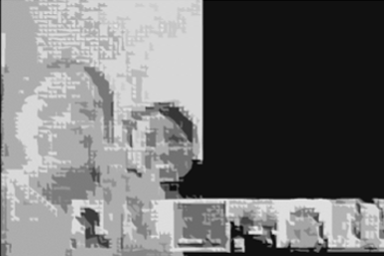

--- 
title: |
  {width=0.20in} "Ciência de Dados na Educação Pública: Relatório 2021.1"
author: "Equipe Ciência de Dados na Educação Pública"
site: bookdown::bookdown_site
documentclass: book
bibliography: [book.bib, packages.bib]
biblio-style: apalike
link-citations: yes
---

# Ciência de Dados na Escola Pública

<div class="capa">
Iniciativa para inclusão da Ciência de Dados e da Inteligência Artificial na Educação Pública do Brasil
<div class="foto_ativ" >

</div>

<div class="leg_ativ">
**Conhecer e Experimentar para Compreender e Transformar**
</div>
</div>

## Apresentação - Relatório 2020.1 

O avanço do uso de informações para solucionar diferentes tipos de questões e problemas gerou muitas mudanças em um curto espaço de tempo na história da sociedade. Novos questionamentos e desafios surgem em um contexto marcado pela Tecnologia da Informação e Comunicação, orientada ou dominada por notícias falsas (fake news), por grandes massas de dados (Big data) e pela internet das coisas (Internet of things). O reconhecimento de problemas e oportunidades requer soluções e tomadas de decisões cada vez mais personalizadas, lançando mão dos avanços da ciência no sentido de contribuir para o incremento das formas de pensar e, com isso, para o impulso da qualidade de vida. Assim, algoritmos e tecnologias trazem na sua concepção também vieses sociais, raciais ou de gênero que beneficiam uma parte privilegiada da sociedade. Por isso, vem sendo preciso desenvolver mecanismos e oportunidades de apoio à formação de cidadãos para torná-los capazes, por exemplo, de entender como as empresas têm acesso aos seus dados, como são construídos modelos que preveem seus desejos e como algoritmos podem afetar suas decisões e seu senso crítico. Cidadãos que usem suas experiências para compreender o universo científico sob diferentes aspectos e com percepção da interdisciplinaridade de soluções de problemas cotidianos; com habilidades de exploração e abstração das diversas realidades e cenários que impactam diretamente ou tangencialmente o seu cotidiano e sua comunidade; com visões críticas ampliadas acerca da cidade e da sociedade, bem como se percebam e atuem como protagonistas de mudanças e transformações da sociedade e resilientes frente a um futuro incerto, agravado durante a pandemia.

<span style="color:blue">Assim, pretende-se formar pessoas de modo holístico, sem
prescindir do viés humanizador que a educação pode propiciar. Em uma das quatro
vertentes do Programa, o trabalho com as dimensões de gênero, raça e classe social visa
o reconhecimento identitário de nossas/os estudantes, mas, sobretudo, torná-las/os
agentes de transformações sociais, agindo local e globalmente, combatendo todo tipo de
segregação. Por isso, acreditamos e incentivamos a Justiça social por meio da educação,
focando nossas discussões na equidade e no respeito aos Direitos Humanos.</span>

*"Não podemos inserir indivíduos menos privilegiados em uma\ estrutura social que é originalmente codificada para os\ privilegiados, temos que mudar a estrutura." \
Parafraseando Mary Beardy para Women & Power: O Manifesto,\ 2017: "You cannot easily fit women into a structure that is\ already coded as male; you have to change the structure."*

## Objetivos {-}

O projeto Ciência de Dados na Educação Pública
atua no desenvolvimento de ferramentas e meios para
apoiar a formação de estudantes e a capacitação de
professoras/es na área de ciência de dados de modo
a reconhecerem, construírem e proporem soluções
para problemas da sociedade.
Ampliando as ações do Projeto Meninas na Ciência
de Dados, passa-se a abraçar toda comunidade
escolar, estudantes do ensino fundamental II e médio,
sem distinção de sexo.
<span style="color:blue">A nova estratégia de ação, além de contar com a
liderança integrada entre as escolas, a universidade e
a comunidade, fundamenta todo o material didático
utilizado e em construção no cotidiano de vulnerabilidades sociais, raciais e de gênero, visando estender a outras
escolas da rede pública, e assim, a construção de novos territórios educacionais.</span>

## Público-alvo {-}

As ferramentas desenvolvidas visam beneficiar 1000 estudantes de cinco escolas públicas: Colégio Estadual Evaristo da Veiga (EV), Colégio Estadual Henriqueta Martins Catharino (HM), Colégio Estadual Ypiranga (YP), Colégio Estadual Mário Costa Neto (MC) e Escola Municipal Cidade de Jequié (CJ), 
através de uma parceria em construção com o Instituto Anísio Teixeira (IAT). Assim, trabalha-se para que todo o material desenvolvido e em desenvolvimento seja disponibilizado para toda a rede de ensino público (e privado). 
A Figura \@ref(fig:estudcdnaep) é apresentada a equipe de estudantes bolsistas do projeto. Atualmente, em um contexto pandêmico, que dificulta o acesso a encontros on-line, 29 estudantes participam de modo frequente, mas este número triplicará com o retorno das atividades presenciais.

```{r estudcdnaep,echo=FALSE,out.width="95%",out.height="95%", fig.cap='Equipe de estudantes bolsistas do projeto Ciência de Dados na Escola Pública', echo=FALSE, message=FALSE, warning=FALSE}
knitr::include_graphics("images/image111.png")
```

## Equipe {-}

Uma equipe multidisciplinar, composta por estudantes de graduação (5) e pós-graduação (7) e por professoras/es e profissionais que atuam em instituições de ensino superior se dividem em sete grupos de ação: 

 - Coordenação e Secretaria;
    - Karla Esquerre (Profª Engª Química - UFBA)
    - Reijane Gomes (Secretária)
 - Ciência de Dados;
    - Júlia Carolina Bijos (Doutoranda - PEI-UFBA)
    - Janaína Souza (Graduanda - Engenharia Química - UFBA)
    - Kaike Wesley Reis (Graduando - Engenharia de Controle e Automação - UFBA)
 - Inteligência Artificial;
    - Ana Luísa Nogueira dos Santos (Graduanda - Engenharia Química - UFBA)
    - Lais Bastos Pinheiro (Mestranda em Controle e Automação)
 - Produção do Conhecimento Científico;
    - Rejane de Almeida Santana dos Santos (Doutoranda - PEI-UFBA)
    - Simão Urpia (Graduando  - Engenharia Química - UFBA)
    - Elaine Christine de Magalhães Cabral Albuquerque (Profª de Engª Química - UFBA)
    - Luciana Martinez (Profª do Departamento de Engenharia Elétrica - UFBA)
 - (re)Conhecendo Salvador;
    - Nícole Príncipe (Mestranda - PEI-UFBA)
    - Thalita Sena (Graduanda - BI-UFBA)
    - Robson Wilson Silva Pessoa (Doutorando - PEI-UFBA)
    - Marcos Narciso (Doutorando - PEI-UFBA)
    - Silvia Miranda (Profª do Departamento de Transportes - UFBA )
 - Protagonismo;
    - Daniele dos Santos Lima (Educadora - UFBA)
    - Ana Carolina Costa (Graduanda - Engenharia Química - UFBA)
    - Talita Costa (Doutoranda - Antropologia - UFBA)
 - Avaliação de Impactos do Projeto.
    - Ícaro Bernardes (Mestrando - PEI-UFBA)
    - Sandro Cabral (Insper Metrics)
- Comunicação 
    - Roseline Vanessa Santos Oliveira (Profª da Faculdade de Arquitetura e Urbanismo - UFAL)
    - Daniele dos Santos Lima (Educadora - UFBA)
    - Thalita Sena (Graduanda - BI-UFBA)


## Ações do Projeto {-}

As atividades desenvolvidas durante o ano de 2020 podem ser agrupadas em cinco grandes ações,

 - Construção de ferramentas para apoiar professoras/es e estudantes
   - \@ref(website) Construção do Website do Projeto
   - \@ref(ebooks) Elaboração de 4 E-books 
   - \@ref(ressa) Elaboração do site (re)Conhecendo Salvador, contendo estatísticas históricas da cidade
   - \@ref(ensaprend) Desenvolvimento e acesso a novos métodos e metodologias de ensino e aprendizagem
 - Conexão entre teoria e prática
   - \@ref(prodconh) Desenvolvimento do pensamento científico
   - \@ref(ressa) Construção e exploração do site (re)Conhecendo Salvador
 - Encantamento e capacitação de professoras/es
   - \@ref(cafecdados) Encontros virtuais com professores (Café com Dados)
   - \@ref(cdia) Produção de textos sobre Inteligência Artificial
   - \@ref(cdia) Construção da disciplina Inteligência Artificial
   - \@ref(parciat) Construção de uma parceria com professores do IAT
 - Encantamento e formação de estudantes
   - \@ref(encest) Encontros virtuais com estudantes bolsistas
   - \@ref(podcast) Produção de Podcasts: Mulheres extraordinárias
   - \@ref(pubescol) Encantamento do público escolar para o engajamento nas ações do Projeto
 - Percepção dos impactos do projeto
   - \@ref(impactquali) Percepção com base qualitativa
   - \@ref(impactquant) Percepção com base quantitativa
   - \@ref(avalgeralimpact) Impactos do projeto 

 Juntamente com as demais seções, este relatório busca descrever de forma sucinta tais ações e seus resultados, assim como os desafios e dificuldades encontradas que exigiram o reajuste das atividades planejadas inicialmente.


