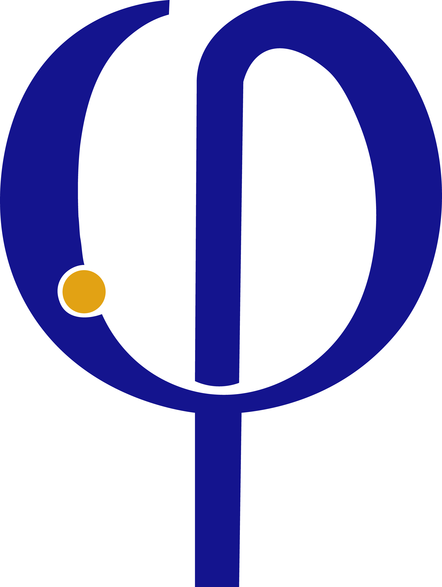
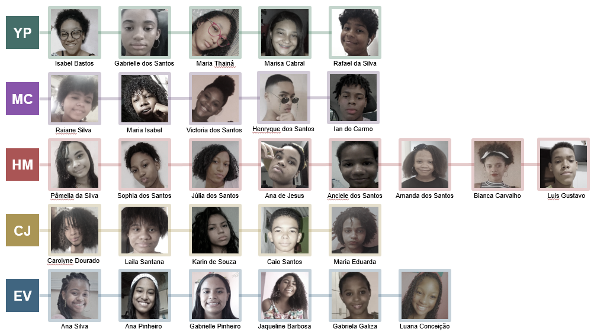
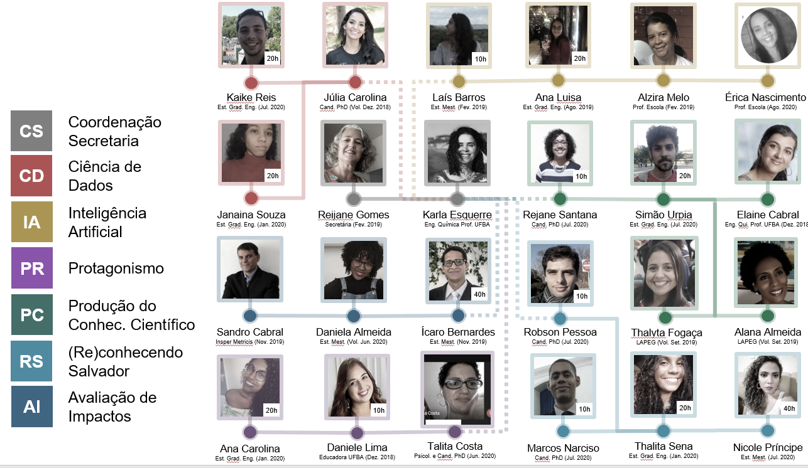

--- 
title: |
  {width=0.25in} "Ciência de Dados na Educação Pública: Relatório 2021.1"
author: "Equipe Ciência de Dados na Educação Pública"
site: bookdown::bookdown_site
documentclass: book
bibliography: [book.bib, packages.bib]
biblio-style: apalike
link-citations: yes
---


# Apresentação - Relatório 2020.1 

O avanço do uso de informações para solucionar diferentes tipos de questões e problemas gerou muitas mudanças em um curto espaço de tempo na história da sociedade. Novos questionamentos e desafios surgem em um contexto marcado pela Tecnologia da Informação e Comunicação, orientada ou dominada por notícias falsas (fake news), por grandes massas de dados (Big data) e pela internet das coisas (Internet of things). O reconhecimento de problemas e oportunidades requer soluções e tomadas de decisões cada vez mais personalizadas, lançando mão dos avanços da ciência no sentido de contribuir para o incremento das formas de pensar e, com isso, para o impulso da qualidade de vida. Assim, algoritmos e tecnologias trazem na sua concepção também vieses sociais, raciais ou de gênero que beneficiam uma parte privilegiada da sociedade. Por isso, vem sendo preciso desenvolver mecanismos e oportunidades de apoio à formação de cidadãos para torná-los capazes, por exemplo, de entender como as empresas têm acesso aos seus dados, como são construídos modelos que preveem seus desejos e como algoritmos podem afetar suas decisões e seu senso crítico. Cidadãos que usem suas experiências para compreender o universo científico sob diferentes aspectos e com percepção da interdisciplinaridade de soluções de problemas cotidianos; com habilidades de exploração e abstração das diversas realidades e cenários que impactam diretamente ou tangencialmente o seu cotidiano e sua comunidade; com visões críticas ampliadas acerca da cidade e da sociedade, bem como se percebam e atuem como protagonistas de mudanças e transformações da sociedade e resilientes frente a um futuro incerto, agravado durante a pandemia.


*"Não podemos inserir indivíduos menos privilegiados em uma\ estrutura social que é originalmente codificada para os\ privilegiados, temos que mudar a estrutura." \
Parafraseando Mary Beardy para Women & Power: O Manifesto,\ 2017: "You cannot easily fit women into a structure that is\ already coded as male; you have to change the structure."*

## Objetivos {-}

O projeto Ciência de Dados na Educação Pública atua no desenvolvimento de ferramentas e meios para apoiar a formação de estudantes e a capacitação de professoras/es na área de ciência de dados de modo a reconhecerem, construírem e proporem soluções para problemas da sociedade. 
Ampliando as ações do Projeto Meninas na Ciência de Dados, passa-se a abraçar toda comunidade escolar, estudantes do ensino fundamental II e médio, sem distinção de sexo.
A nova estratégia de ação, além de cotar com a liderança integrada entre as escolas, a universidade e a comunidade, fundamenta todo o material didático utilizado e em construção no cotidiano de vulnerabilidades sociais, raciais e de gênero, mas estende-se a outras escolas da rede pública, visando, assim, a construção de novos territórios educacionais.

## Público Alvo {-}

As ferramentas desenvolvidas visam beneficiar 1000 estudantes de cinco escolas públicas: Colégio Estadual Evaristo da Veiga (EV), Colégio Estadual Henriqueta Martins Catharino (HM), Colégio Estadual Ypiranga (YP), Colégio Estadual Mário Costa Neto (MC) e Escola Municipal Cidade de Jequié (CJ). 
Através de uma parceria em construção com o Instituto Anísio Teixeira, trabalha-se para que todo o material desenvolvido e em desenvolvimento seja disponibilizado para toda a rede de ensino público (e privado). 
Na Figura \@ref(fig:estudcdnaep) é apresentada a equipe de estudantes bolsistas do projeto. Atualmente, em um contexto pandêmico, que dificulta o acesso a encontros on-line, 29 estudantes participam de modo frequente, mas este número triplicará com o retorno das atividades presenciais.

```{r estudcdnaep, fig.cap='Equipe de estudantes bolsistas do projeto Ciência de Dados na Escola Pública', echo=FALSE, message=FALSE, warning=FALSE}

```

## Equipe {-}

Uma equipe multidisciplinar, composta por estudantes de graduação (5) e pós-graduação (7) e por professoras/es e profissionais que atuam em instituições de ensino superior se dividem em sete grupos de ação (ver Figura \@ref(fig:profcdnaep)): 

 - Coordenação e Secretaria;
 - Ciência de Dados;
 - Inteligência Artificial;
 - Produção do Conhecimento Científico;
 - (re)Conhecendo Salvador;
 - Protagonismo;
 - Avaliação de Impactos do Projeto.

```{r profcdnaep, fig.cap='Equipe do projeto Ciência de Dados na Escola Pública', echo=FALSE, message=FALSE, warning=FALSE}

```

## Ações do Projeto {-}

As atividades desenvolvidas durante o ano de 2020 podem ser agrupadas em cinco grandes ações, conforme descrito a seguir (seções 1-5). Juntamente com as demais seções, este relatório busca descrever de forma sucinta tais ações e seus resultados, assim como os desafios e dificuldades encontradas que exigiram o reajuste das atividades planejadas inicialmente.


**COLOCAR LISTA SUMARIO**
